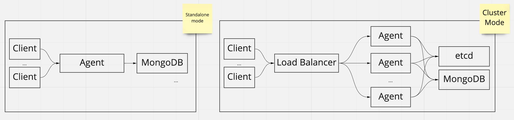
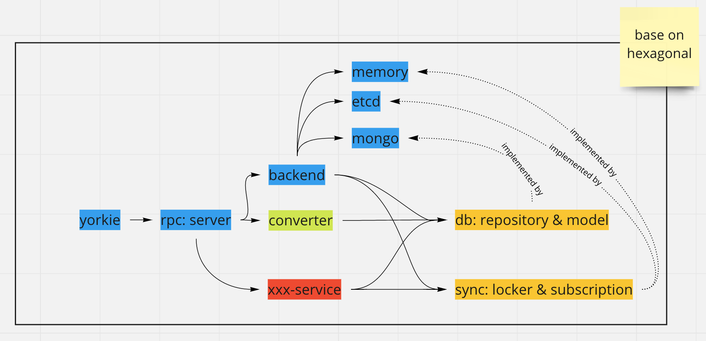

# Cluster Mode

## Summary

In a production environment, it is generally expected more than one agent to
handle client's requests. Even if an agent goes down, the other agents must be
able to handle the request. To support this scenario, agents must be able to
increase or decrease easily in the cluster. We will provide a Cluster Mode in
which multiple agents can run by moving agent's local state to a remote
location.

### Goals

Provide cluster mode when the user sets the etcd configuration. If the user
does not set etcd configuration, agent runs in the standalone mode as before.



### Non-Goals

In the cluster, the load balancer is not provided by Yorkie directly, we only
provide a guide for users to configure themselves for their own environment.

## Proposal details

### How to use

When users set etcd configuration in `config.json`, internal etcd client is
created to store agent's states at the remote location when the agent starts.

```json
{
  "RPC": {
    "Port": 11101,
    "CertFile": "",
    "KeyFile": ""
  },
  // ... other configurations...
  "ETCD": {
    "Endpoints": ["localhost:2379"]
  }
}
```

### How does it work?

The agent's states to be moved to remote are as follows:
- `LockerMap`: A map of locker used to maintain consistency of metadata of the
documents such as checkpoints when modifying documents.
- `SubscriptionMap`: A map of subscription used to deliver events to other peers
when an event such as a document change occurs.

The interfaces of `LockerMap` and `SubscriptionMap` are defined in the
`backend/sync` package and there are memory-based implementations in
`backend/sync/memory` and etcd-based implementations in `backend/sync/etcd`.



#### LockerMap based on etcd

The etcd-based implementation of `LockerMap` uses the lock and unlock of [etcd
concurrency API](https://etcd.io/docs/v3.4.0/dev-guide/api_concurrency_reference_v3/).
The concurrency API provides lease time to avoid the problem that crashed agent
holding a lock forever and never releasing it.

Because many factors(e.g. [stop-the-world GC pause of a runtime](https://martin.kleppmann.com/2016/02/08/how-to-do-distributed-locking.html)) can cause false
expiration of a granted lease, `serverSeq` is used as a fencing token.

![fencing tokens][fencing-tokens]

```go
// backend/db/mongo/client.go > StoreChangeInfos
res, err := c.collection(ColDocuments, opts).UpdateOne(ctx, bson.M{
	"_id":        encodedDocID,
	"server_seq": initialServerSeq,
}, bson.M{
	"$set": bson.M{
		"server_seq": docInfo.ServerSeq,
		"updated_at": now,
	},
})
if res.MatchedCount == 0 {
	return nil, fmt.Errorf("%s: %w", docInfo.ID, db.ErrConflictOnUpdate)
}
```

[fencing-tokens]: https://martin.kleppmann.com/2016/02/fencing-tokens.png
