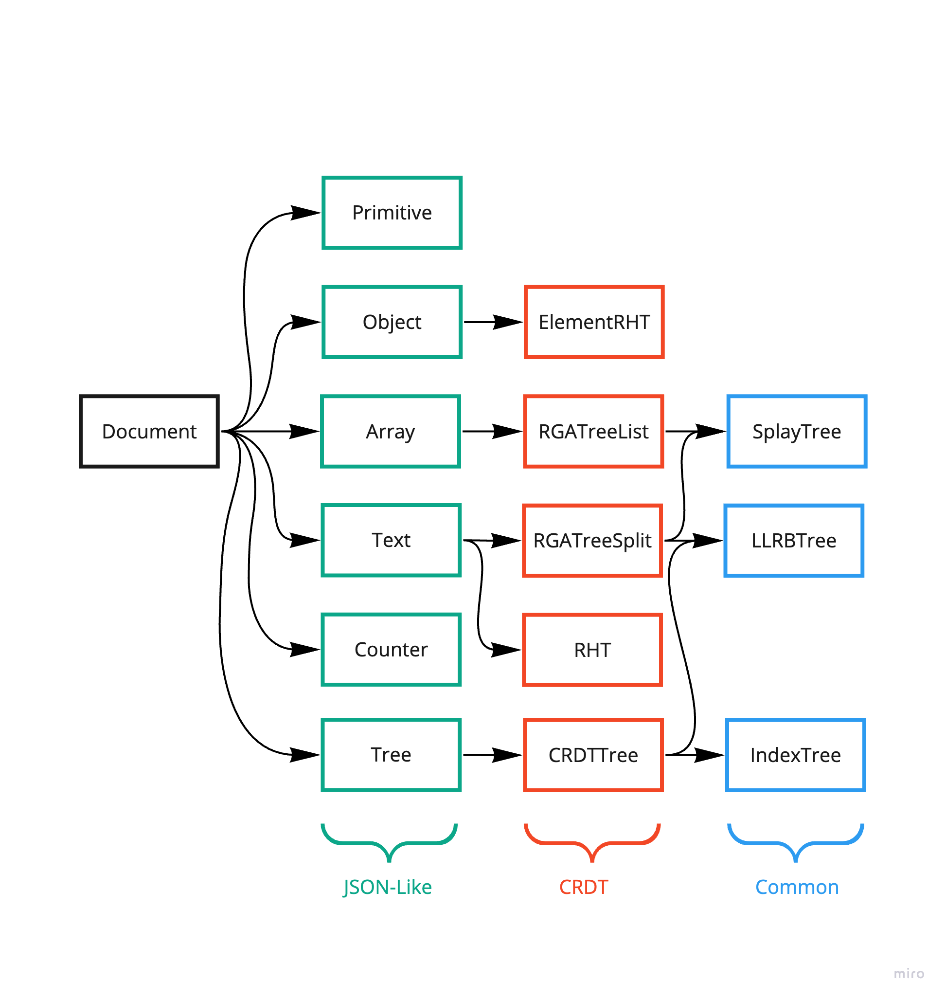

# Data Structures

This document covers the data structures in the `crdt` package of SDKs.

## Summary

The `crdt` package has data structures for representing the contents of the `Document` edited by the user.
This document explains what data structures are used for and how they refer to each other.

### Goals

The purpose of this document is to help new SDK contributors understand how existing data structures are structured.

### Non-Goals

This document does not describe algorithms in distributed systems such as [CRDT](https://en.wikipedia.org/wiki/Conflict-free_replicated_data_type)s or [logical clock](https://en.wikipedia.org/wiki/Logical_clock)s.

## Proposal Details

The `crdt` package has data structures for representing the contents of the `Document` which can be edited by the user.

### Overview

The overall structure of the data structures is as follows:



The data structures can be divided into three groups:

- JSON-like: Data structures that are used when the user edits a `Document`.
- CRDT: CRDTs are used by JSON-like group to resolve conflicts.
- Common: Data structures that are used for general purposes.

The data structures of each group have the dependencies shown in the figure above, and the data structures on the left use the data structures on the right.

### JSON-like Group

The data structures of JSON-like group are used when editing `Document`s and can be edited through proxies.
For example:

```js
doc.update((root) => {
  // set a `Primitive<string>` "world" to the root `object` at key "hello".
  root.hello = 'world'; // { "hello": "world" }

  // set an `array` [1, 2, 3] to the root `object` at key "array".
  root.array = [1, 2, 3]; // { "hello": "world", "array": [1, 2, 3] }

  // push a `Primitive<number>` 4 to the `array` at the end.
  root.array.push(4); // { "hello": "world", "array": [1, 2, 3, 4] }
});
```

The code above uses `Primitive`, `Object`, `Array` and `Text` in JSON-like group.

- `Primitive`: A data structure that used to represent primitive data such as `string`, `number`, `boolean`, `null`, and so on.
- `Object`: A data structure that used to represent [object type](https://developer.mozilla.org/en-US/docs/Web/JavaScript/Reference/Global_Objects/Object) of JavaScript. Just like JavaScript, you can use `Object` as [hash table](https://en.wikipedia.org/wiki/Hash_table).
- `Array`: A data structure that used to represent [array type](https://developer.mozilla.org/en-US/docs/Web/JavaScript/Reference/Global_Objects/Array) of JavaScript. You can also use `Array` as [list](https://en.wikipedia.org/wiki/List_(abstract_data_type)).
- `Text`: A data structure that used to represent contents in text-based editors such as [CodeMirror](https://github.com/yorkie-team/yorkie-js-sdk/blob/main/examples/index.html). It is similar to `string` type of `Primitive`, but unlike `string`, multiple users can modify parts of the contents without conflict.
- `RichText`: A data structure that used to represent contents in rich text editors such as [Quill](https://github.com/yorkie-team/yorkie-js-sdk/blob/main/examples/quill.html). It is similar to `Text`, but users can express styles such as bold and italic to the contents.

### CRDT Group

The data structures of CRDT group are used by JSON-like group to resolve conflicts in concurrent editing.

- `RHT`(Replicated Hash Table): A data structure similar to hash table, but resolves conflicts even if multiple users edit at the same time.
- `RHTPQMap`: A data structure extends `RHT` and has a [priority queue](https://en.wikipedia.org/wiki/Priority_queue) to resolve conflicts for the same key. Logically added later will have higher priority([LWW, Last Writer Win](https://crdt.tech/glossary)).
- `RGATreeList`: A data structure extends `RGA(Replicated Growable Array)`, and has an additional index tree with the linked list. The index tree manages the indexes of elements, and the tree provides fast access to the element at the int-based index.
- `RGATreeSplit`: A data structure extends `RGATreeList` and allows characters to be represented as blocks rather than single characters.

### Common Group

The data structures of common group can be used for general purposes.

- `Heap`: A data structure representing a priority queue. We use [max heap](https://en.wikipedia.org/wiki/Heap_(data_structure)) so that the last added value has the highest priority(LWW).
- `SplayTree`: A tree that moves nodes to the root by [splaying](https://en.wikipedia.org/wiki/Splay_tree#Splaying). This is effective when user frequently access the same location, such as text editing. We use `SplayTree` as an index tree to give each node a weight, and to quickly access the node based on the index.
- `LLRBTree`: A tree that is [simpler](https://en.wikipedia.org/wiki/Left-leaning_red%E2%80%93black_tree) than Red-Black Tree. We added a `floor` method to the `LLRB` tree. The `floor` method finds the node of the largest key less than or equal to the given key.
- `Trie`: A data structure that can quickly search for prefixes of sequence data such as strings. We use `Trie` to remove nested events when the contents of the `Document`' are modified at once.

### Risks and Mitigation

We can replace the data structures with better ones for some reason, such as performance. For example, `SplayTree` used in `RGATreeList` can be replaced with [TreeList](https://commons.apache.org/proper/commons-collections/apidocs/org/apache/commons/collections4/list/TreeList.html).