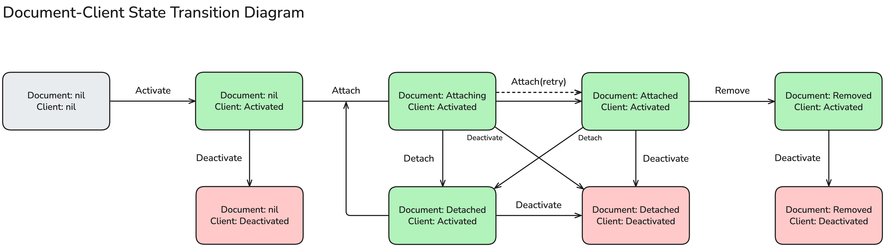

<!-- Make sure to append document link in design README.md after creating the document. -->

# Document-Client Lifecycle

## Summary

In the Yorkie system, a document life-cycle starts in the **nil** state, transitions through `Attached`, `Detached`, and `Removed` states, and is eventually deleted. Each state described in this document represents the activity status, connection status, and deletion status of the document and client. This document explains the state transitions and the available actions in each state, especially including the `Removed` state, to help understand the full lifecycle of documents and clients.

## Goals

* Define and explain the state transition model of documents and clients.
* Clarify the available actions (Attach, Detach, Remove, Deactivate, etc.) in each state.
* Describe the behavior of document deletion, particularly the `Removed` state(soft delete).

## Non-Goals

* The implementation details of hard deletion (physical removal) are not covered.

## State Transition Diagram

The following is a diagram illustrating the state transitions of clients and documents.

This diagram consists of the following elements:

* States are composed of **Document** and **Client** states respectively.
* Green represents active clients, red represents deactivated clients, and gray represents the initial state.
* Arrows indicate possible transitions, each requiring specific conditions and operations.

## State Definitions and Transitions

### Initial State

* **Document: nil / Client: nil**
* No client or document has been registered in Yorkie.
* The client can be activated via `Activate()`.

### Client Activated

* **Document: nil / Client: Activated**
* The client is registered in Yorkie, but no document is attached yet.
* In this state, documents can be attached via `Attach()`.

### Document Attaching

* **Document: Attaching / Client: Activated**
* The client is attempting to attach to a document.
* If it fails, `Attach(retry)` is possible. On success, it transitions to the `Attached` state.

### Document Attached

* **Document: Attached / Client: Activated**
* The document is successfully attached to the client.
* Only in this state are `Detach`, `Remove`, `Deactivate`, and `PushPull` operations allowed.

### Document Detached

* **Document: Detached / Client: Activated**
* The document has been detached, but the client remains active.
* In this state, the document can be reattached using `Attach()`, or the client can be deactivated using `Deactivate()`.
* Detached documents are not the target of [GC](https://github.com/yorkie-team/yorkie/blob/main/design/garbage-collection.md), which may leave stale tombstone nodes. Reattaching must follow certain constraints to maintain node consistency. See below.

> [!NOTE]
> 📌 About Document Reattach
>
> Reattach refers to the act of a client reattaching a previously detached document.
>
> - Allowed Reattach:
>   - Reattach is supported if a new Document instance is created and then attached.
>   - The same client can reattach the same document only by creating a new instance with `new Document(key)` and attaching it.
>
> - Disallowed Reattach:
>   - Reusing a detached Document instance to attach is not supported.
>   - This is by design to ensure GC (Garbage Collection) consistency and to prevent inconsistent internal states.

### Removed State

* **Document: Removed / Client: Activated**
* The document has been soft-deleted.
* In this state, editing or reattaching the document is no longer possible.
* After a certain period, the document is permanently deleted by a background process.
* Even in this state, the client can be deactivated via `Deactivate()`.

## Client Deactivated States

From any document state, if the client is deactivated via `Deactivate()`, the system enters the following state:

* **Client: Deactivated**

  * The document may be unlinked (`nil`, `Detached`) or already deleted (`Removed`).
  * The client has terminated its connection and can be reactivated via `Activate()`.

## Document Deletion (Remove) Behavior

Documents can only be deleted in the `Attached` state. Deletion is soft and proceeds as follows:

1. The client calls the `RemoveDocument` API to request document deletion (`IsRemoved = true`).
2. The server sets the document’s `docInfo.RemovedAt` field to the current time, marking it as soft-deleted.
3. All subsequent responses will include the `IsRemoved = true` flag, notifying other peers of the deletion.
4. After the configured period, a housekeeping process performs actual deletion (hard delete) of the document and its data.

> [!NOTE]
> 📌 Documents cannot be removed from the `Detached` state. Deletion requests must be made only in the `Attached` state.

### Key - ID Mapping Changes

Before the document deletion feature was introduced, the `Key - ID` relationship was 1:1. Now, with support for recreating documents after deletion, the `Key - ID` relationship has changed to 1\:N. This means that multiple documents with the same `Key` can exist, and identifying documents by `ID` is now essential.

## Recap

In Yorkie, clients and documents follow the lifecycle below:

* Clients can repeatedly be `Activated` and `Deactivated`.
* Documents start from the `nil` or `Detached` state, go through the `Attaching` state, and finally reach the `Attached` state.
  * Only in the Attached state are `Detach`, `Remove`, `Deactivate`, and `PushPull` operations allowed.

Reattaching a detached document using the same instance is not allowed; you must create a new Document instance to attach.

Document deletion is only possible in the Attached state. Deleted documents enter the Removed state and are handled as soft-deleted. After a set period, they are physically deleted by a background process.

With the introduction of document deletion, the Key-ID relationship has shifted from 1:1 to 1:N, and using the ID is now required for document identification.
