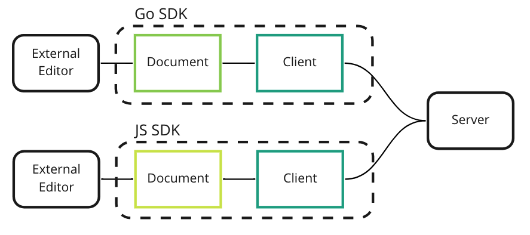
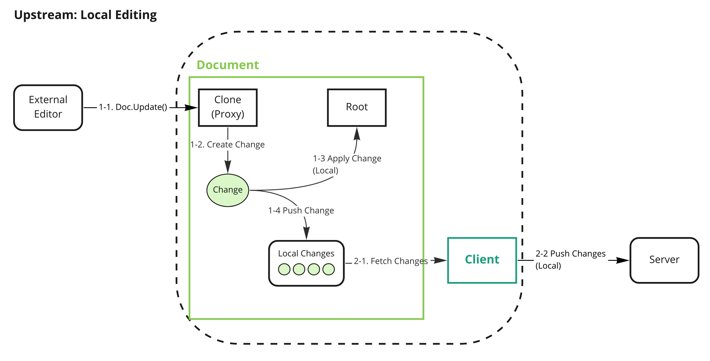
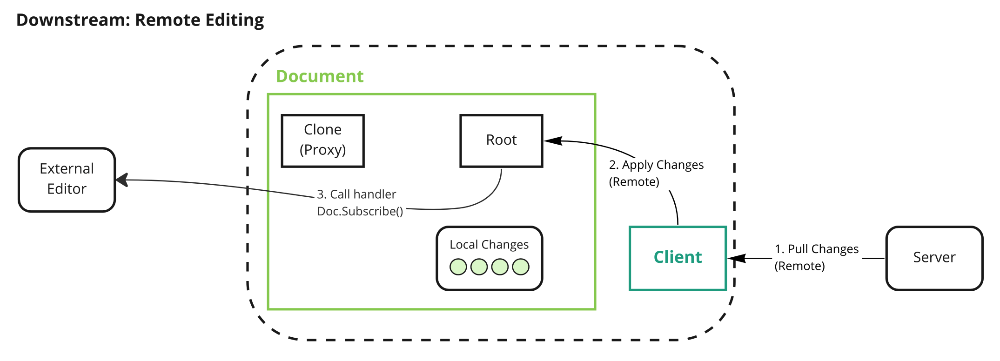

# Document Editing

This document covers document editing executed in the SDK.

## Summary

Document Editing is a mechanism to modify the document. It consists of two parts, Local and Remote.
We will provide a simple document editing example in the SDK to show how it works.

### Goals

The purpose of this document is to help new SDK contributors to understand the SDK's editing behavior.

### Non-Goals

This document does not describe algorithms such as CRDTs or logical clocks.

## Proposal Details

First, we briefly describe `Client` and `Document` and then explain what happens inside the Client and Document when editing a document.

### Overview

A high-level overview of Yorkie is as follows:



A description of the main components is as follows:
- SDK consists of `Client` and `Document`.
- `Client`: `Client` is a normal client that can communicate with `Server`. The `Changes` on the `Document` can synchronized by the `Client`.
- `Document`: `Document` is a JSON-like data type through which the model of the application is represented.
- `Server`: `Server` receives changes from `Client`s, stores them in the DB, and propagates them to `Client`s who subscribe to `Document`s.

Next, we will look at how `Client` and `Document` described in Overview work when editing occurs.

Editing in Yorkie can be divided into Local Editing and Remote Editing.

Local Editing occurs on the machine where it is running. Conversely, Remote Editing occurs on another machine that is editing the `Document`.

### Local Editing

Local Editing is started by calling the `Document.Update`. `Document.Update` is usually called whenever edit occurs in the external editor.



The figure above explains the Document in more detail, and three internal components are added.

- `Root` represents the root of JSON object. This component is a `Proxy` and is used to create `Changes` when editing of the `Root` is executed. It is just a proxy not real document(SOT, source of truth).
- `CRDT` represents the real document and keep the consistency even if changes are applied asynchronously.
- `LocalChanges` is a buffer used to collect locally generated Changes before sending them to the server. The Client checks if changes are exist in LocalChanges and sends them to the server.

Local Editing consists of tree logic parts.

1. Calling `Document.Update`
   - 1-1. When the function is called, `Proxy` creates Changes.
   - 1-2. And then the changes are added to LocalChanges.
   - 1-3. The changes also apply to the CRDT. The CRDT is only updated by changes.
2. Pushing Changes to Server: Client checks LocalChanges of Document at specific intervals and sends them to the `Server`.
3. Propagating Changes to Peers: Server stores changes received by the Client and propagates them to other peers who subscribe the Document.

#### 1. Calling `Document.Update`

The updater function, the first argument of `Document.Update`, provides the `Root` as the first argument. The external editor executes the methods of the `Root` to edit the Document. The `Root` is a Proxy, and whenever editing occurs, changes are created internally and the changes are pushed to Local Changes. These logics work synchronously.

```go
// Go SDK
doc.Update(func(root *json.Object) {
    root.SetString("foo", "bar")
})
fmt.Println(doc.Marshal()) // {"foo": "bar"}
```

#### 2. Pushing Changes to Server

The server checks whether changes are exist in the LocalChanges at specific intervals. If LocalChanges has changes that need to be synchronized with other peers, it collects them and sends them to the server. These logics work asynchronously.

#### 3. Propagating Changes to Peers

The server that receives the changes from the client store the changes and then propagates the changes to other clients that are subscribing the document.

### Remote Editing

Remote Editing starts when the server responds the changes to the client at the last part of Local Editing.



The client that receives the changes applies the changes in the CRDT inside the document. If there are handlers that are externally subscribed to changes through `Doc.Subscribe`, this handlers are called and the ChangeEvents are passed as an argument. All of these logic work synchronously.

```js
// JS SDK
doc.subscribe((event) => {
    console.log(event.type)
});
```

For more details: [Subscribing to Document events](https://yorkie.dev/docs/js-sdk#subscribing-to-document-events)

### Risks and Mitigation

Proxy can vary by language or environment. For example, in JS SDK, the Proxy is implemented as [JavaScript Proxy](https://developer.mozilla.org/en-US/docs/Web/JavaScript/Reference/Global_Objects/Proxy), but in the Go SDK, it is just a struct.
This is to provide users with an interface that suits the characteristics of the language or environment. Proxy component is likely to change to other interfaces later when we find a better way.