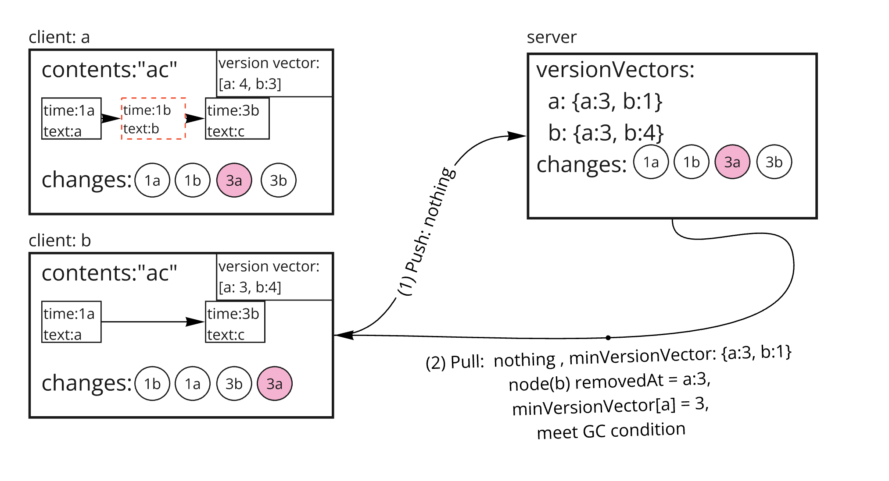

# Garbage Collection

## Before watch this document

In this document, the term referred to as `version vector` will be used throughout for explanatory purpose.
You'd better read [this](https://github.com/yorkie-team/yorkie/pull/981) first to understand concepts and usage of version vector.

## Summary

One of the most important issues in CRDT systems is handling tombstones. Tombstones are used to properly synchronize the document even when remote peer's operations refer to the elements that have already been locally deleted. This causes the problem that the document keeps growing even if elements are deleted.

Yorkie provides garbage collection to solve this problem.

### Goals

Implements garbage collection system that purges unused nodes not being referenced remotely.

### Non-Goals

For text types, garbage collection works slightly differently: refer to [this document](gc-for-text-type.md).

## Proposal Details

### Why We Need Version Vector rather than only use Lamport

Previously we used Lamport (`min_synced_seq`) to handle `Garbage Collection`. It was simple and lightweight to use, but it has crucial weakness that Lamport doesn't guarantee causality.


As you can see from the image above, `min_synced_seq` doesn't guarantee every client receives change.

### How It Works

Garbage collection checks that deleted nodes are no longer referenced remotely and purges them completely.

Server records the version vector of the last change pulled by the client whenever the client requests PushPull. And Server returns the min version vector, `minVersionVector` of all clients in response PushPull to the client. `minVersionVector` is used to check whether deleted nodes are no longer to be referenced remotely or not.

## What is `minVersionVector`

Min version vector is the vector which consists of minimum value of every version vector stored in version vector table in database.

Conceptually, min version vector is version vector that is uniformly applied to all users. It ensures that all users have at least this version applied. Which means that it is safe to perform GC.

```
// GC algorithm

if (removedAt.lamport <= minVersionVector[removedAt.actor]) {
    runGC()
}
```

```
// how to find min version vector

min(vv1, vv2) =>
for (key in vv1 || key in vv2) {
    minVV[key] = min(vv1[key] || 0, vv2[key] || 0)
}

ex)
min([c1:2, c2:3, c3:4], [c1:3, c2:1, c3:5, c4:3])
=> [c1:2, c2:1, c3:4, c4:0]

```

## An example of garbage collection:

### State 1


In the initial state, both clients have `"ab"`.

### State 2


`Client a` deletes `"b"`, which is recorded as a change with versionVector `{b:1}`. The text node of `"b"` can be referenced by remote, so it is only marked as tombstone. And the `Client a` sends change `3a` to server through PushPull API and receives as a response that `minVersionVector` is `{a:1, b:1}`. Since all clients did not receive the deletion `change 3a`, the text node is not purged by garbage collection.

Meanwhile, `client b` inserts `"c"` after textnode `"b"` and it has not been sent (pushpull) to server yet.

### State 3


`Client b` pushes change `3b` to server and receives as a response that `minVersionVector` is `{a:1, b:1}`. After the client applies change `3a`, the contents of document are changed to `ac`. This time, all clients have received change `3a`. Since node "b" is removed at `3a`, it's still marked as tombstone for every clients, because `minVersionVector[a] = 1 < 3`

### State 4


`Client a` pulls change `3b` from Server. `minVersionVector` is still `{a:1, b:1}`, so no GC happens.

### State 5



`Client b` pushpull but nothing to push or pull. `minVersionVector` is now `{a:3, b:1}`, node "b" removedAt is `3@a`, and `minVersionVector[a] = 3 >= 3`, thus `client b` meets GC condition

### State 6


`Client a` pushpull but nothing to push or pull. `minVersionVector` is now `{a:3, b:3}`, node "b" removedAt is `3@a`, and `minVersionVector[a] = 3 >= 3`, thus `client a` meets GC condition
