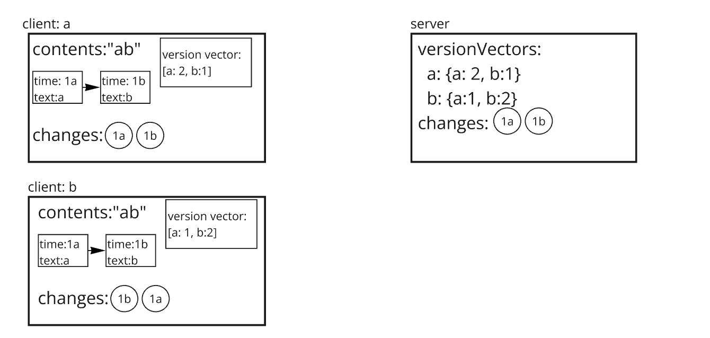
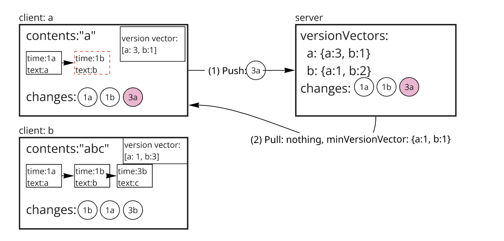
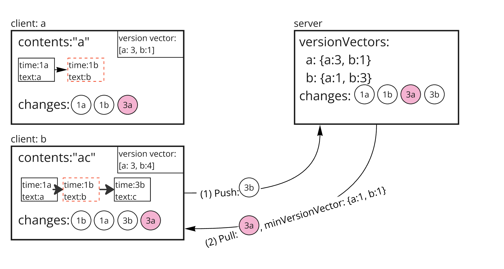
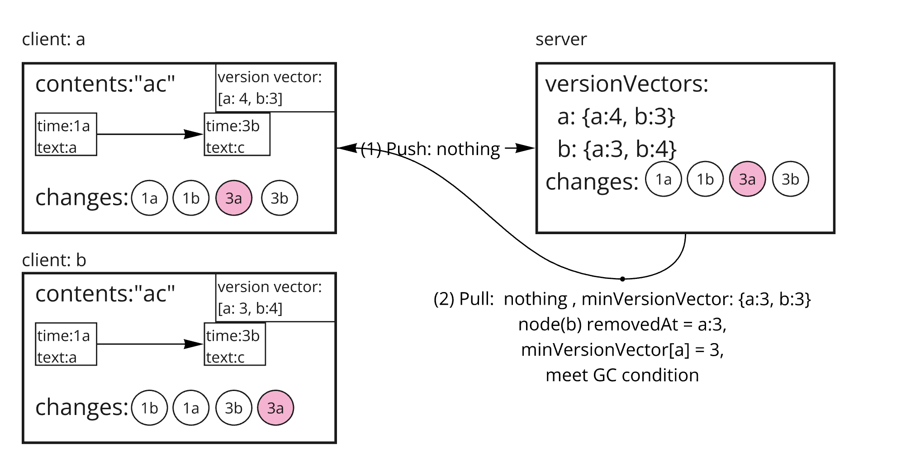

# Garbage Collection

## Before watch this document

In this document, the term referred to as `version vector` will be used throughout for explanatory purpose.
You'd better read [this](https://github.com/yorkie-team/yorkie/pull/981) first to understand concepts and usage of version vector.


## Summary

One of the most important issues in CRDT systems is handling tombstones. Tombstones are used to properly synchronize the document even when remote peer's operations refer to the elements that have already been locally deleted. This causes the problem that the document keeps growing even if elements are deleted.

Yorkie provides garbage collection to solve this problem.

### Goals

Implements garbage collection system that purges unused nodes not being referenced remotely.

### Non-Goals

For text types, garbage collection works slightly differently: refer to [this document](gc-for-text-type.md).

## Proposal Details

### Why We Need Version Vector rather than only use Lamport
Previously we used Lamport (`min_synced_seq`) to handle `Garbage Collection`. It was simple and lightweight to use, but it has crucial weakness that Lamport doesn't guarantee causality.


As you can see from the image above, `min_synced_seq` doesn't guarantee every client receives change.  

### How It Works

Garbage collection checks that deleted nodes are no longer referenced remotely and purges them completely.

Server records the version vector of the last change pulled by the client whenever the client requests PushPull. And Server returns the min version vector, `minVersionVector` of all clients in response PushPull to the client. `minVersionVector` is used to check whether deleted nodes are no longer to be referenced remotely or not.

## What is `minVersionVector`
Min version vector is the vector which consists of minimum value of every version vector stored in version vector table in database.

Conceptually, min version vector is version vector that is uniformly applied to all users. It ensures that all users have at least this version applied. Which means that it is safe to perform GC.


```
// GC algorithm

if (removedAt.lamport <= minVersionVector[removedAt.actor]) {
    runGC()
} else if (removedAt.lamport < minVersionVector.minLamport()) {
    runGC()
}
```

```
// how to find min version vector

min(vv1, vv2) =>
for (key in vv1 || key in vv2) {
    minVV[key] = min(vv1[key] || 0, vv2[key] || 0)
}

ex)
min([c1:2, c2:3, c3:4], [c1:3, c2:1, c3:5, c4:3])
=> [c1:2, c2:1, c3:4, c4:0]

```
### How we handle if min version vector includes detached client's lamport.
We have to wipe out detached client's lamport from every version vector in db and other client's local version vector.


For example,
```
// initial state
c1.versionVector = {c1:4, c2:3, c3: 4}
c2.versionVector = {c1:3, c2:4, c3: 5}
c3.versionVector = {c1:3, c2:3, c3: 6}

db.versionVector = {
    c1: {c1:4, c2:3, c3: 4},
    c2: {c1:3, c2:4, c3: 5},
    c3: {c1:3, c2:3, c3: 6}
}

// process
1. c1 detach and remove its version vector from db.

db.versionVector = {
    c2: {c1:3, c2:4, c3: 5}
    c3: {c1:3, c2:3, c3: 6}
}

2. compute minVersionVector
min(c2.vv, c3.vv) = min({c1:3, c2:4, c3: 5}, {c1:3, c2:3, c3:5}) = {c1:3, c2:3, c3:5}

```
as you can see from above, c1's lamport is still inside minVersionVector, and also in every client's local document's version vector too.

So we need to filter detached client's lamport from
1. db.version vector
2. other client's local version vector.

But it causes n+1 query problem to remove lamport from db.versionVector. So we choose remove only client's version vector from table, and filter minVersionVector by active clients.

```
// initial state
db.versionVector = {
    c1: {c1:3, c2:4, c3: 5},
    c2: {c1:3, c2:3, c3: 6}
}
min(c1.vv, c2.vv) = min({c1:3, c2:4, c3: 5}, {c1:3, c2:3, c3:5}) = 
{c1:3, c2:3, c3:5}
c1, c2 are acitve(attached).

minVersionVector = {c1:3, c2:3, c3:5}.Filter([c3]) = {c1:3, c2:3}
```

After client receive this minVersionVector, it will filter its version vector to remove detached client's lamport.
The next pushpull request will contains filtered version vector so that eventually db.version vector will store attached client's version vector only.


### Why `removedAt.lamport <= minVersionVector[removedAt.actor]` is not enough to run GC
Let's consider the following scenario.

Users A, B, and C are participating in a collaborative editing session. User C deletes a specific node and immediately detaches the document. In this situation, the node deleted by C remains in the document, and C's version vector is removed from the version vector table in the database.

Previously, we stated that to find the minimum version vector, we query all vectors in the version vector table in the database and take the minimum value. After C detaches, if we create the minimum version vector by querying the version vector table, the resulting minimum version vector will not contain C’s information.

Our existing garbage collection (GC) algorithm performs GC when the condition removedAt.lamport <= minVersionVector[removedAt.actor] is satisfied. However, if the actor who deleted the node does not exist in the minimum version vector, this logic will not function.

Therefore, the algorithm needs to be designed so that GC is performed even in situations where the actor who deleted the node is not present in the minimum version vector.

### Is it safe to run GC in condition `removedAt.lamport < minVersionVector.minLamport()` 
We can understand this by considering the definitions of the version vector and the minimum version vector.

A version vector indicates the editing progress of a user’s document, including how much of other users’ edits have been incorporated. For example, if A’s version vector is `[A:5, B:4, C:2]`, it means that A’s document reflects changes up to 4 made by B and up to 2 made by C.

Expanding this further, let’s assume three users have the following version vectors:

- A: `[A:5, B:4, C:2]`
- B: `[A:3, B:4, C:2]`
- C: `[A:2, B:1, C:3]`

We assume that C deleted a specific node with their last change.

In this situation, if C detaches from the document, only A’s and B’s version vectors remain, and the minimum version vector would become `[A:3, B:4]`. When can we perform garbage collection (GC) to delete the node removed by C at `[A:2, B:1, C:3]`?

By examining the minimum version vector at this point, we can consider two scenarios:

1. Only A and B were participating in the editing from the beginning.
2. There was another user besides A and B, but that user has now detached.

In the first scenario, the existing algorithm that operates when `removedAt.lamport <= minVersionVector[removedAt.actor]` applies, so we don’t need to address it further.

The second scenario presents a potential issue, as a node removed by someone else remains as a tombstone. To remove this tombstone, we need a minimum guarantee.

If we express the execution criterion of the GC algorithm in semantic terms, it would be:

> "The point at which all users are aware that a specific node has been removed."

From the moment C detaches, information about C is removed from each version vector. So, how can we know that C deleted a specific node? Since there’s no direct way to determine this in the minimum version vector due to the lack of information, we need to verify this fact indirectly.

From the perspective of the version vector and the minimum version vector, this means that the minimum value in the minimum version vector should be greater than removedAt.

Of course, it’s possible for a specific client to have a timestamp greater than removedAt without knowing that C deleted the node. However, this case can be addressed by calculating the minimum lamport value in the minimum version vector.

What’s essential here is having a consistent criterion. If we take the node’s removedAt as this criterion, and if a lamport value greater than this criterion exists in the minimum version vector, then it is safe to delete the node.


### What if MinVersionVector is empty?
Since minVersionVector is consist of lamport from active clients, there's a case where min version vector is empty.
Think about the case there's only one active client remains, and that client deactivates. After server receives deactivate request, it delete client's version vector from VersionVector table. When server compute minVersionVector for response pack with there's no active client, which means version vector table is empty, the result of computed min version vector is empty. When client receives response and applying it, GC runs

If the min version vector is empty, calculating the min Lamport will return the maximum value.
This happens because the logic for minLamport is set to return int64max when the min version vector is empty. Additionally, all remaining tombstones are removed through the garbage collection (GC) process.
According to the GC logic, all remaining tombstones are cleared.

An empty version vector indicates that there are no active clients, which means it is safe to run GC.
This is because the document is no longer being used by any client. Of course, one could argue that the result of minLamport should be 0 instead of max when the min version vector is empty. However, this scenario—where the min version vector is empty—only occurs in special cases, such as when the last user deactivates.
Moreover, there is no issue in removing all tombstones at the point of deactivation, as it aligns with the intended semantics.


## An example of garbage collection:
### State 1



In the initial state, both clients have `"ab"`.

### State 2



`Client a` deletes `"b"`, which is recorded as a change with versionVector `{b:1}`. The text node of `"b"` can be referenced by remote, so it is only marked as tombstone. And the `Client a` sends change `3a` to server through PushPull API and receives as a response that `minVersionVector` is `{a:1, b:2}`. Since all clients did not receive the deletion `change 3a`, the text node is not purged by garbage collection.

Meanwhile, `client b` inserts `"c"` after textnode `"b"` and it has not been sent (pushpull) to server yet.

### State 3



`Client b` pushes change `3b` to server and receives as a response that `minVersionVector` is `{a:1, b:1}`. After the client applies change `4`, the contents of document are changed to `ac`. This time, all clients have received change `3a`. Since node "b" is removed at `3a`, it's still marked as tombstone for every clients, because `minVersionVector[a] = 1 < 3` 

### State 4


`Client a` pulls change `3b` from Server. `minVersionVector` is still `{a:1, b:1}`, so no GC happens.

### State 5


`Client b` pushpull but nothing to push or pull. `minVersionVector` is now `{a:3, b:1}`, node "b" removedAt is `3@a`, and `minVersionVector[a] = 3 >= 3`, thus `client b` meets GC condition 

### State 6



`Client a` pushpull but nothing to push or pull. `minVersionVector` is now `{a:3, b:1}`, node "b" removedAt is `3@a`, and `minVersionVector[a] = 3 >= 3`, thus `client a` meets GC condition

