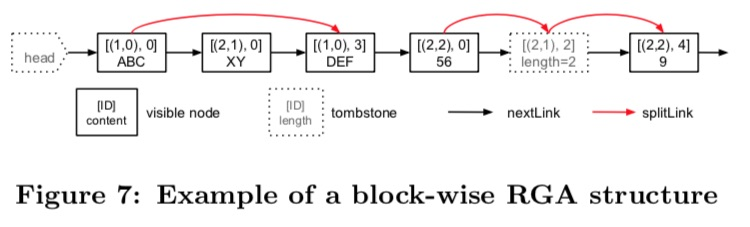

# Garbage collection for Text Type

## Summary

When all synchronization between clients is complete, the node marked tombstone is no longer needed.
As the number of nodes marked tombstone increases, unnecessary memory waste occurs.
So it provides garbage collection to solve the problem of wasting memory.

### Goals

Implements garbage collection for text types, Text, and RichText. When
executing garbage collection of a document, text nodes marked with
tombstones are also deleted.

### Non-Goals

1. It does not directly control the garbage collection provided by the programming language. It simply removes the relationship of the nodes connected to the linked list and makes it a collection target.
2. It is not a feature that Yorkie users can use directly.

## Proposal details

### How dose it work?

#### Save changed text
Text nodes that are deleted when editing text become tombstones and are stored in the `RGATreeSplit` instance.
And text elements with text nodes that are deleted during the editing process are stored in the `Root` instance.
And `Root` instance is managed by `Document` instance.

The important point when text elements are stored is that they must be stored in both the `Document` that is provided to the user and the `Document` that holds the original data.
That's because the two `Document` use separate memory addresses, and even the same text values have different memory addresses.

```go
// pkg/document/document.go

type Document struct {
	// doc is the original data of the actual document.
	doc *InternalDocument

	// clone is a copy of `doc` to be exposed to the user and is used to
	// protect `doc`.
	clone *json.Root
}
```

When garbage collection is enabled, both the original and copied data are checked to collect garbage.

#### Garbage collection run
And when the client syncs, Yorkie's garbage collection runs. 
>The important thing is that the user does not call it directly. If the user calls it directly, it may cause unintended behavior and cause problems for the entire program.
>Currently, `Document.GarbageCollect` is exposed to users as a public method, so it may be misunderstood. We are aware of this issue and are working through issue [#125](https://github.com/yorkie-team/yorkie/issues/125).

Cleans up tombstone marked nodes by traversing the modified text elements stored in the `Root` instance.
Organized nodes are excluded from the linked list and are subject to garbage collection provided by the programming language.

```bash
# input 'abc'
 +-----+        +-----+        +-----+
 | 'a' |   ->   | 'b' |   ->   | 'c' |
 +-----+        +-----+        +-----+

# remove 'b'
              (tombstoned)
 +-----+        +-----+        +-----+
 | 'a' |   ->   | 'b' |   ->   | 'c' |
 +-----+        +-----+        +-----+

# after running gc
 +-----+        +-----+
 | 'a' |   ->   | 'c' |
 +-----+        +-----+

           (Collection target)
               (tomstone)    
                +-----+
                | 'b' |
                +-----+
```
>It only makes it a garbage collection target. If we use `runtime.GC()` directly, performance degradation will occur due to frequent `GC` calls.

What you need to know at this time is that `RGATreeSplitNode` has `insPrev` and `insNext`.
Must also do the work to connect the relationship between `insPrev` and `insNext`.



> `insPrev` and `insNext` are used to remember other nodes connected to the insert.
> For example, when `abc` is divided into `a`, `b`, `c`, it looks like this: [abc] divided to [a]<->[b]<->[c]

