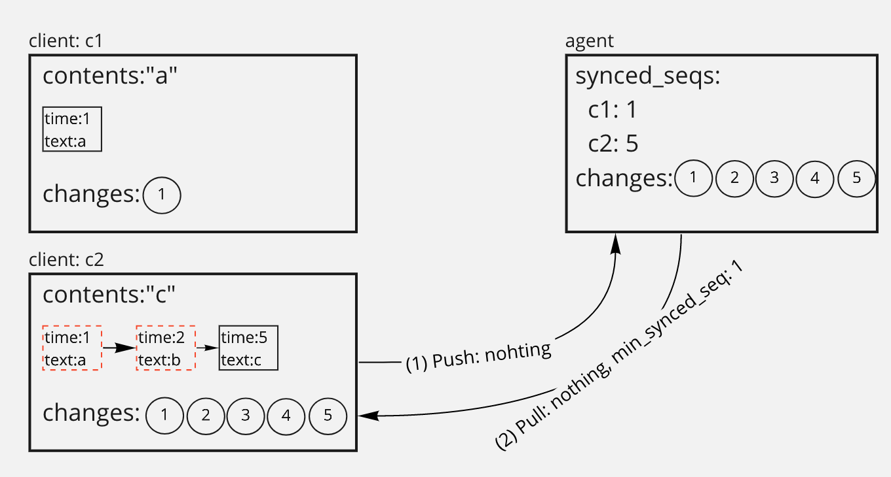
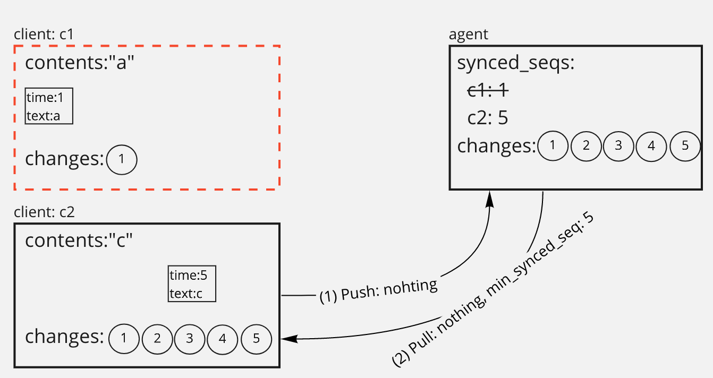

# Housekeeping

## Summary

We provide [Garbage Collection](garbage-collection.md) to purge tombstones and prevent the problem of
documents growing.

However, when there are clients that has been editing old documents but have not
been used for a long time, garbage collection becomes less efficient.

To solve this problem, we implement a housekeeping service that deactivates
outdated clients.

### Goals

Implement a housekeeping service that deactivates outdated clients.

## Proposal Details

### How does it work?

If there are outdated clients, garbage collection becomes less efficient.

In this example, client `c1` is outdated, the tombstone which has `a`
as its contents can not be purged because it is still being referenced by `c1`.

Agent periodically fetches outdated clients from the database. If the update
times of clients are older than a certain threshold, the clients are candidates
for deactivation.

In the deactivation process, the documents of the candidates are detached and
all `synced_seq`s of the clients removed from `synced_seqs` collection.

As a result, when calculating `min_synced_seq` to include in PushPull's
response, old `synced_seq` are removed so that relatively recently deleted
tombstones can be purged.

In the above example, client `c1` is deactivated, the tombstone which has
`a` can be purged because it is not being referenced by `c1`.
