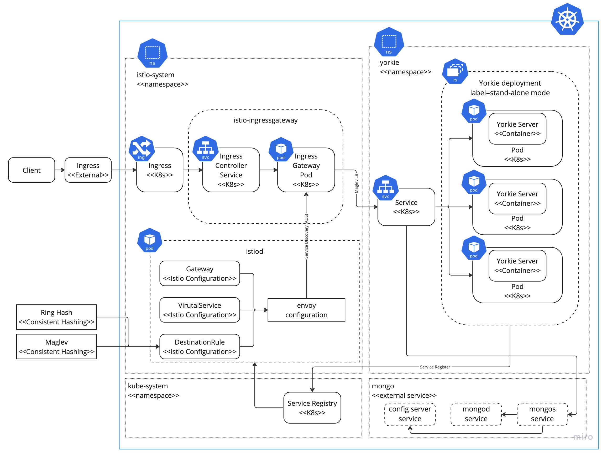

# Lookup Cluster Mode

## Summary

In production environment, server clusters are necessary to handle large amount of workloads with ensuring high availability, reliability, and scalability.

Yorkie provides two cluster mode options to support production environment: Broadcast cluster mode and Lookup cluster mode.

Broadcast cluster mode is based on broadcasting, pub/sub, and distributed lock between servers. This cluster mode can handle certain amount of workloads, but there are limitations like broadcast, pub/sub, lock overheads to synchronize workloads. Due to these limitations, broadcast cluster mode may be not enough for production mode.

The root cause of these limitations is the fact that because workloads are distributed throughout all server clusters, therefore additional synchronization throughout all servers is needed.

Lookup cluster mode’s main idea is to assign each server to process same workloads to avoid multiple servers accessing to same data, and put lookup system to route same workloads to same servers.

Lookup cluster mode can reduce/remove additional overheads needed for workload synchronization in previous broadcast cluster mode, and become capable of handling large amount of workloads with ensuring high availability, reliability, and scalability.

### Goals

Provide lookup cluster mode on server when user deploys K8s manifest files to Kubernetes cluster.

Provide various methods to deploy lookup cluster mode.

- `Helm` chart to simply deploy cluster mode on K8s
- `Kustomization` to customize manifest and deploy cluster mode on K8s.

### Non-Goals

Additional configuration for specific CSP(Cloud Service Provider) is not provided.

Only manifests, configurations, and guides for deploying lookup cluster mode in K8s environment are provided.

## Proposal Details

> This is where we detail how to use the feature with snippet or API and describe
the internal implementation.
>

### How to use

There are two ways to deploy lookup cluster mode on K8s environment.

1. Helm Chart

   User can deploy lookup cluster mode with following command:

    ```bash
    # Add Helm chart repositories
    $ helm repo add stable https://charts.helm.sh/stable
    
    # Install Yorkie Lookup cluster mode Chart
    $ helm install stable/yorkie
    ```

2. Manual Deploy (Kustomization)

   User can manually deploy lookup cluster mode with following command:

    ```bash
    # If you have not installed istioctl then you must install istioctl.
    $ curl -L https://istio.io/downloadIstio | sh -
    
    # Copy istioctl in path.
    $ cp ~/.istioctl/bin/istioctl ~/bin
    
    # Deploy Istio System with IstioOperator
    $ istioctl install -f cluster/istio/istio-operator.yaml
    
    # Set auto envoy sidecar injetion in namespace
    $ kubectl label namespace yorkie istio-injection=enabled
    
    # Deploy Istio configuration files
    $ kubectl create -f cluster/istio
    
    # Create Namespace
    $ kubectl create namespace yorkie
    
    # Deploying Yorkie, MongoDB
    $ kubectl create -k apps/yorkie
    ```


### How does it work?

**System Design & Architecture**

The architecture design of lookup cluster mode is as follows:


- `Yorkies`: Yorkies is router(proxy) responsible for two tasks.
    - Routing based on request: Yorkies receives requests from client and route to server based on computed request’s hash key and ring hash algorithm.
    - Stream aggregation: Yorkies recieves two watch API streams from different servers and aggregate into one stream.
- `Yorkie service registry`: Service registry is responsible for storing metadata and configuration settings of yorkie servers just like mongoDB’s config servers.
- `Yorkie Service(s)`: Services to process specific workloads. There can be two type of service structure.
    - Single Server: Single Yorkie server process workload.
    - Cluster Server(Broadcast Mode): Yorkie cluster process heavy workloads. Broadcast based cluster mode can be reused to build cluster.
- `mongo`: mongoDB is responsible for sharding and persisting data. There are several components in mongo system.
    - `mongos`: mongos is router responsible for routing data to correct shard based on data’s hash key.
    - `shard`: mongod is actual database responsible for persisting incomding data.
    - `config servers`: Config servers are responsible for storing metadata and configuration settings for the shard. `mongos` use this information for routing.

**Workload Unit**

Lookup cluster mode uses `document` as workload unit to assign each server to process same workloads. This assigns and seperates `document`’s state and data to each server, which remove needs for share and sync states and data between server cluster.

**Server Mapping Strategy**

Lookup cluster mode uses [consistent hashing](https://en.wikipedia.org/wiki/Consistent_hashing) for server mapping strategy.

Consistent hashing is a technique used to map a range of input values (such as request metadata) to a corresponding range of output values (such as server IDs).

The basic idea of consistent hashing is to assign each server to a point on a circular ring or continuum of hash values. When a request arrives, its hash value is computed, and the server responsible for that hash value is determined by finding the next server on the ring, starting from the point where the hash value falls.

This ensures nearby hash values to be assigned to the same server, providing a degree of consistency in server assignments.


As you can see above, computed hash value is mapped to closest server in clockwise direction, therefore `k0(keyo)` is mapped to `s0(server 0)`. Also, even when `s0` fails, `k0` can be mapped to `s4(server 4)`, this mechanism is helpful when server scale out/scale in, or failover.

**LookUp Strategy**

Lookup cluster mode uses server side discovery for lookup strategy.


In server side discovery, there is proxy server(load balancer) in front of services. After services register themselves to service registry, proxy server can get service locations from service registry. Now when client connect to proxy server, proxy server route to proper service based on service registry’s information.

**API Compatiability**

Lookup cluster mode supports API compatiability.

All APIs in Yorkie successfully compatiable with cluster mode except one API; `watchDocuments()`, which is responsible for mutli-document. This is because multiple document on distributed servers are sending `watchDocuments()` streams individually.

To support API compatiability with `watchDocuments()`, stream aggregator is introduced to aggreagte two `watchDocuments()` streams into one single stream.

…

**Server Addition & Removal Strategy**

Lookup cluster mode uses [consistent hashing](https://en.wikipedia.org/wiki/Consistent_hashing)(ring hash) to handle server addition & removal strategy.

Ring hash keeps previous hash key mapping the same and successfully add/remove servers.

…

**Lookup Cluster Mode Implementation (K8s & Istio)**

Below is internal implementation architecture for lookup cluster mode based on K8s and Istio.



Yorkies and Service Registry can be simply implemented by using Istio's `Ingress Gateway(envoy)`, `envoy sidecar injection` as `Yorkies`, and `Istio Pilot` for service registry. When deploying Yorkie cluster pods, Istio automatically register pods and configure traffic routes.

`Gateway`, `VirtualService`, and `DestinationRule` are used to configure `envoy` inside ingress gateway and envoy sidecar.

Especially, `consistentHash` in `DestinationRule` is used to implement ring hash based lookup system.

```yaml
apiVersion: networking.istio.io/v1alpha3
kind: DestinationRule
metadata:
  name: yorkie
spec:
  host: yorkie
  trafficPolicy:
      portLevelSettings:
      - port:
          number: 11101
        loadBalancer:
          consistentHash:
            httpHeaderName: "x-api-key"
```

In this configuration, HTTP header is for hash function parameter. This routes workload based on http header’s value. For example, using `x-api-key` seperates workloads in `project` unit.

Also, `Istio`’s `grpc-web` [appProtocol](https://github.com/istio/istio/pull/10064) is used to configure `envoy`’s `gRPC-web` filter for `HTTP` → `gRPC` protocol conversion needed for web SDK.

```yaml
apiVersion: v1
kind: Service
metadata:
  name: yorkie
  namespace: yorkie
  labels:
    app: yorkie
spec:
  clusterIP: None
  selector:
    app: yorkie
  ports:
    - port: 11101
      name: yorkie-sdk-port
      appProtocol: grpc-web
```

Also, `corsPolicy` in `VirtualService` is configured to configure `CORS` for `gRPC-web` to be accessed externally.

```yaml
apiVersion: networking.istio.io/v1alpha3
kind: VirtualService
metadata:
  name: yorkie
spec:
  hosts:
  - "*"
  gateways:
  - yorkie-gateway
  http:
  - name: yorkie-service
    match:
    - uri:
        prefix: "/yorkie.v1.YorkieService"
    route:
    - destination:
        host: yorkie
        port:
          number: 11101
    corsPolicy:
      allowOrigin:
        - "*"
      allowMethods:
        - POST
        - GET
        - OPTIONS
        - PUT
        - DELETE
      allowHeaders:
        - grpc-timeout
        - content-type
        - keep-alive
        - user-agent
        - cache-control
        - content-type
        - content-transfer-encoding
        - custom-header-1
        - x-accept-content-transfer-encoding
        - x-accept-response-streaming
        - x-user-agent
        - x-grpc-web
        - authorization
        - x-api-key
      maxAge: 1728s
      exposeHeaders:
        - custom-header-1
        - grpc-status
        - grpc-message
      allowCredentials: true
```

When using Istio’s `ringHash` in [ConsistentHashLB](https://istio.io/latest/docs/reference/config/networking/destination-rule/#LoadBalancerSettings-ConsistentHashLB), Istio performs consistent hashing for both server endpoints and request for us.

Internally, Istio uses [Ketama](https://github.com/RJ/ketama) hashing for endpoint hashing, and [xxHash](https://github.com/Cyan4973/xxHash) for HTTP header hashing. Both two algorithms are well-known algorithms for evenly distributing hash values.

**Stream Aggregation**

`aggegator server` written in go is used to perform stream aggregation. This can be done by following code:

```go
func aggregateStreams(stream1 yorkie.WatchDocumentsResponse, stream2 yorkie.WatchDocumentsResponse, stream myservice.MyService_AggregateStreamsServer) {
    for {
        select {
        case res1, ok := <-stream1.RecvCh():
            if ok {
                // Send the response from stream1 to the client
            } else {
                // Stream1 has closed
            }
        case res2, ok := <-stream2.RecvCh():
            if ok {
                // Send the response from stream2 to the client
            } else {
                // Stream2 has closed
            }
        }
    }
}

func (s *server) AggregateStreams(stream yorkie.AggregateStreamsServer) error {
    stream1, err := s.client.Stream1(context.Background(), &yorkie.WatchDocumentsRequest{})
    if err != nil {
        // Handle error
    }

    stream2, err := s.client.WatchDocuments(context.Background(), &yorkie.WatchDocumentsRequest{})
    if err != nil {
        // Handle error
    }

    go aggregateStreams(stream1, stream2, stream)

    // Wait for both streams to close
    <-stream1.Done()
    <-stream2.Done()

    return nil
}
```

After that, aggreagator servers is registered to `K8s`, or `Istio`’s `ServiceEntry`, and `Istio`’s `envoy sidecar`, or `Egress Gateway` is used to send stream response to aggreagtor server.

```yaml
apiVersion: networking.istio.io/v1alpha3
kind: VirtualService
metadata:
  name: yorkie-stream-aggregator
spec:
  hosts:
    - stream-aggregator.yorkie.dev
  gateways:
    - istio-egressgateway
  http:
    - name: grpc-web
      match:
        - port: 11101
          protocol: grpc-web
      route:
        - destination:
            host: yorkie-stream-aggregator
            port:
              number: 11101
```
