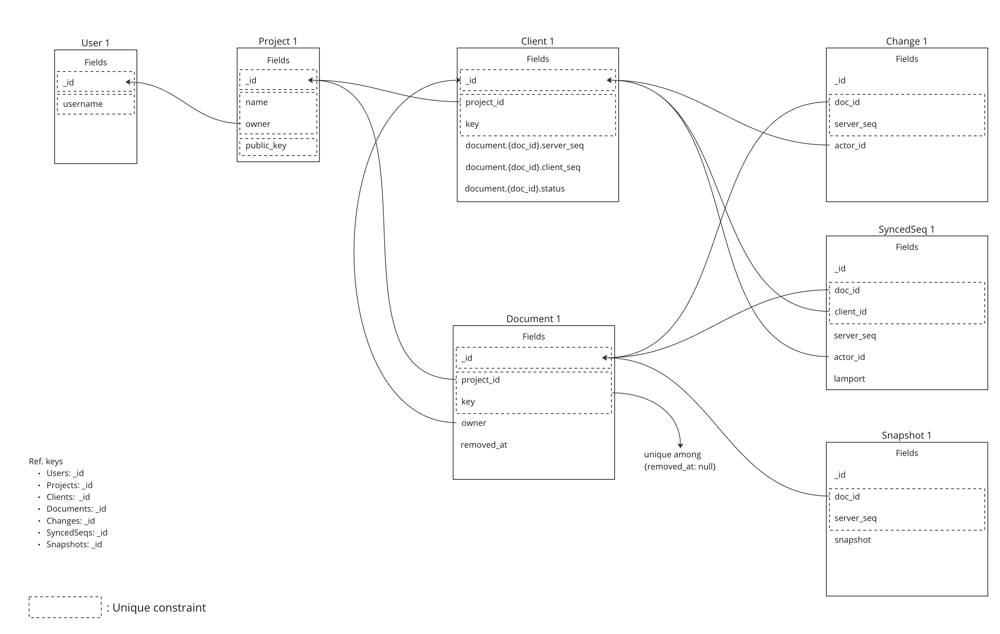
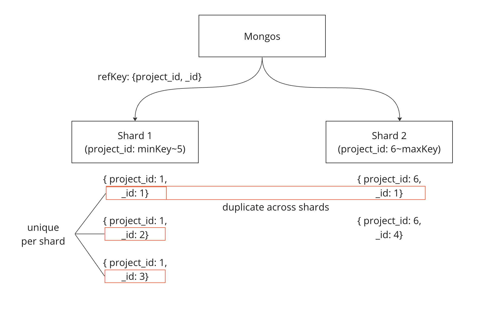
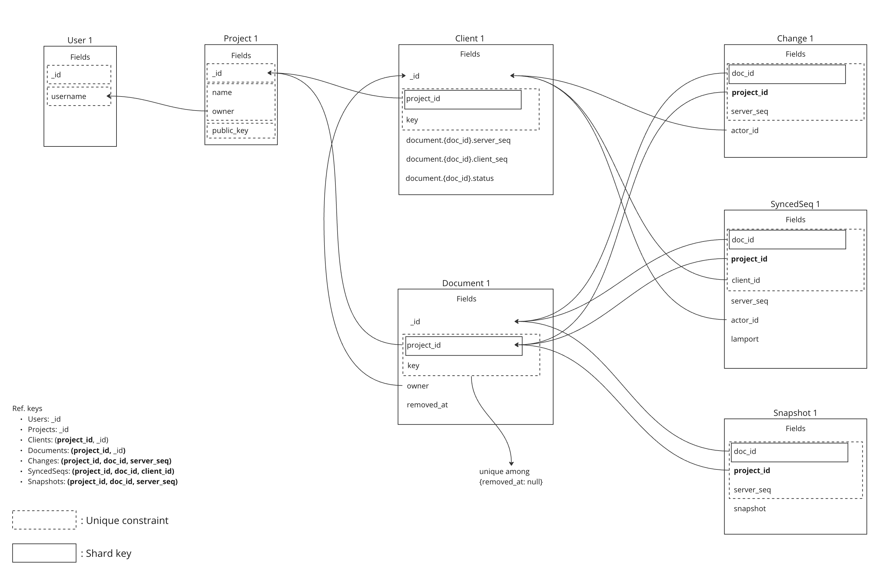
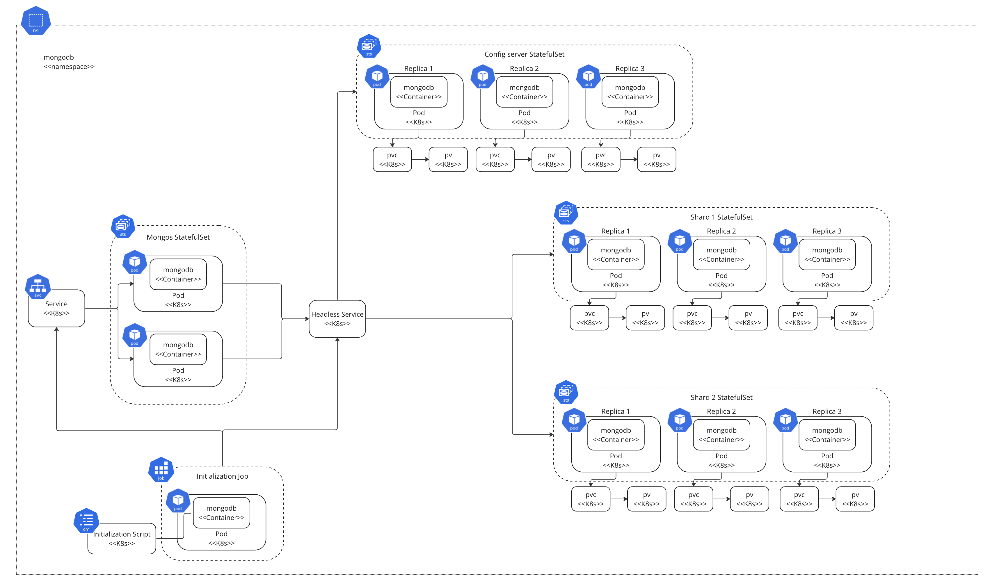
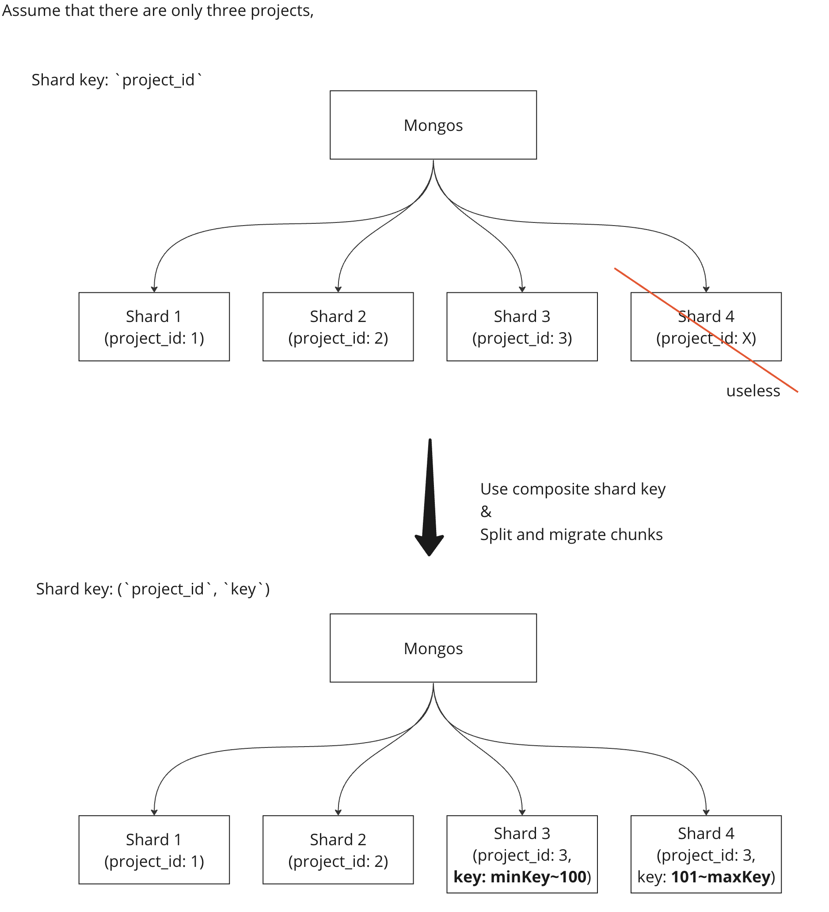
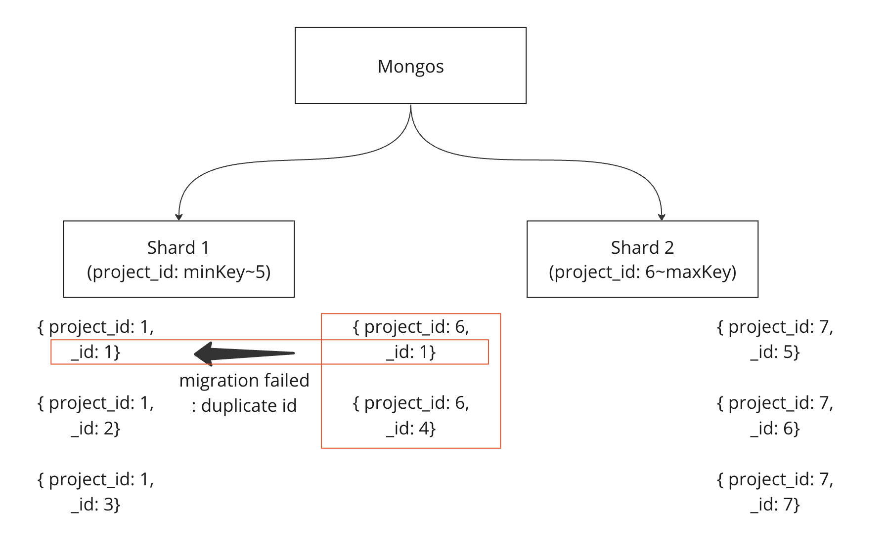

# MongoDB Sharding

## Summary

The Yorkie cluster is responsible for storing the majority of the data in the database. Therefore, most loads are concentrated on database clusters rather than application servers. In production environment scenarios, supporting sharding becomes essential for distributing data and query loads across horizontally-scalable DB clusters.

Yorkie now provides compatibility with sharded MongoDB clusters.

The selected sharding strategy, including the target collection, the shard keys, and the sharding method (hashed/ranged), is determined according to various factors such as expected data counts, unique constraints, and query patterns.

### Goals

Provide compatibility with sharded MongoDB clusters based on requirements in the production environment.

### Non-Goals

This document will only explain the core concepts of the selected sharding strategy. Background knowledge about MongoDB sharding and additional detailed configuration in the K8s environment will not be covered in this document.

## Proposal Details

### Design Considerations

**Relations between Collections**

1. Cluster-wide: `users`, `projects`
2. Project-wide: `clients`, `documents`, `schemas`
3. Document-wide: `changes`, `snapshots`, `versionvectors`, `revisions`



**Sharding Goals**

Shard Project-wide and Document-wide collections due to the large number of data count in each collection

- Cluster-wide: less than `10,000`
- Project-wide: more than `1` million
- Document-wide: more than `100` million

**Unique Constraint Requirements**

1. `documents`: `(project_id, key, removed_at)`
2. `changes`: `(doc_id, server_seq)`
3. `snapshots`: `(doc_id, server_seq)`
4. `versionvectors`: `(doc_id, client_id)`

**Main Query Patterns**

Project-wide collections contain range queries with a `project_id` filter.

```go
// Clients - FindActiveClients for housekeeping
// Note: This query causes scatter-gather across all shards since it doesn't
// include project_id in the filter, but it's used infrequently for maintenance.
cursor, err := c.collection(ColClients).Find(ctx, bson.M{
    "_id":    bson.M{"$gt": lastClientID},
    "status": database.ClientActivated,
}, options.Find().SetSort(bson.M{"_id": 1}).SetLimit(int64(candidatesLimit)))
```

```go
// Documents
filter := bson.M{
    "project_id": bson.M{
        "$eq": projectID,
    },
    "removed_at": bson.M{
        "$exists": false,
    },
}
if paging.Offset != "" {
    k := "$lt"
    if paging.IsForward {
        k = "$gt"
    }
    filter["_id"] = bson.M{
        k: paging.Offset,
    }
}

opts := options.Find().SetLimit(int64(paging.PageSize))
if paging.IsForward {
    opts = opts.SetSort(map[string]int{"_id": 1})
} else {
    opts = opts.SetSort(map[string]int{"_id": -1})
}

cursor, err := c.collection(ColDocuments).Find(ctx, filter, opts)
```

Document-wide collections mostly contain range queries with a `doc_id` filter.

```go
// Changes
cursor, err := c.collection(ColChanges).Find(ctx, bson.M{
    "project_id": docRefKey.ProjectID,
    "doc_id":     docRefKey.DocID,
    "server_seq": bson.M{"$gte": current, "$lte": to},
}, options.Find().SetSort(bson.D{{Key: "server_seq", Value: 1}}))
```

```go
// Snapshots
result := c.collection(ColSnapshots).FindOne(ctx, bson.M{
    "project_id": docRefKey.ProjectID,
    "doc_id":     docRefKey.DocID,
    "server_seq": bson.M{
        "$lte": serverSeq,
    },
}, option)
```

### Sharding Strategy

**Selected Shard Keys and Methods**

The shard keys are selected based on the query patterns and properties (cardinality, frequency) of keys.

1. Project-wide:
   - `Clients`: `(project_id, _id)`, hashed on `_id`
   - `Documents`, `Schemas`: `project_id`, ranged
2. Document-wide: `doc_id`, hashed

Every unique constraint can be satisfied because each has the shard key as a prefix.

1. `Documents`: `(project_id, key, removed_at)`
2. `Changes`: `(doc_id, server_seq)`
3. `Snapshots`: `(doc_id, server_seq)`
4. `Versionvectors`: `(doc_id, client_id)`

Note: The `Clients` collection uses a composite shard key `(project_id, _id)` with hashed `_id` to ensure even distribution across shards while maintaining query efficiency. The unique constraint on `(project_id, key)` has been removed to support high-concurrency scenarios where clients are frequently created and deactivated.

**Benefits of Hashed Sharding for Document-wide Collections**

Hashed sharding for document-wide collections provides:

1. **Even Data Distribution**: Prevents ObjectID clustering and hotspots caused by timestamp-based sequential generation.
2. **Improved Write Performance**: Distributes writes across all shards instead of concentrating on the latest ObjectID range.
3. **Better Scalability**: New shards immediately participate in handling traffic rather than only new data.

**Changes of Reference Keys**

Since the uniqueness of `_id` isn't guaranteed across shards, reference keys to indicate a single data in collections should be changed.

1. `documents`: `_id` -> `(project_id, _id)`
2. `clients`: `_id` -> `(project_id, _id)`
3. `changes`: `_id` -> `(project_id, doc_id, server_seq)`
4. `snapshots`: `_id` -> `(project_id, doc_id, server_seq)`
5. `versionvectors`: `_id` -> `(project_id, doc_id, client_id)`

Considering that MongoDB ensures the uniqueness of `_id` per shard, `documents` and `clients` can be identified with the combination of `project_id` and `_id`. Note that the reference keys of document-wide collections are also subsequently changed.

For the `clients` collection specifically, the composite shard key `(project_id, _id)` with hashed `_id` allows multiple clients with the same `key` value to exist across different shards, which is essential for high-load scenarios where clients are frequently created without reusing previous client sessions.



**Relations between Collections**



### MongoDB Cluster Architecture

For a production deployment, consider the following to ensure data redundancy and system availability.

- Config Server (3 member replica set): `config1`,`config2`,`config3`
- 3 Shards (each a 3 member replica set):
  - `shard1-1`,`shard1-2`, `shard1-3`
  - `shard2-1`,`shard2-2`, `shard2-3`
  - `shard3-1`,`shard3-2`, `shard3-3`
- 2 Mongos: `mongos1`, `mongos2`



### Risks and Mitigation

**Client Key Management**

Previously, the `Clients` collection used `(project_id, key)` as a unique constraint, allowing client sessions to be reused when reconnecting with the same key. With the change to composite shard key `(project_id, _id)` with hashed `_id`:

1. **New behavior**: Each `ActivateClient` call creates a new client document with a unique `_id`, even if the same `key` is provided.
2. **Benefits**:
   - Eliminates contention on unique constraint checking across shards
   - Supports high-concurrency client activation scenarios
   - Simplifies the activation logic (no upsert required)
3. **Considerations**:
   - Client `key` is stored for reference and shard key purposes but is not unique
   - Deactivated clients should be cleaned up periodically to prevent data accumulation
   - Applications should not depend on client key uniqueness

**Limited Scalability due to High Value Frequency of `project_id`**

When there are a limited number of projects, it's likely for the data to be concentrated on a small number of chunks and shards.
This may limit the scalability of MongoDB clusters, which means adding more shards becomes ineffective.

For the `Clients` collection, this issue is now addressed by using a composite shard key `(project_id, _id)` with hashed `_id`. This allows:

- Splitting large chunks by `_id` values within the same project
- Even distribution of clients across shards even with a limited number of projects
- Effective utilization of newly added shards

For the `Documents` collection, using a composite shard key like `(project_id, key)` could similarly resolve this issue. After that, it's possible to split large chunks by `key` values, and migrate the splitted chunks to newly added shards.



Note: The duplication concern of `client_id` values mentioned below is addressed by the composite shard key implementation for the `Clients` collection, which uses hashed `_id` to ensure globally unique client identifiers across all shards.

**Duplicate MongoDB ObjectID**

Both `client_id` and `doc_id` are currently using MongoDB ObjectID as a value. When duplication of ObjectIDs occurs, it works well due to the changed reference keys, until the MongoDB balancer migrates a chunk with a duplicate ObjectID. This unexpected action may not harm the consistency of documents, but may bring out a temporary failure of the cluster. The conflict should be handled manually by administrators.



However, the possibility of duplicate ObjectIDs is **extremely low in practical use cases** due to its mechanism.
ObjectID uses the following format:

```
TimeStamp(4 bytes) + MachineId(3 bytes) + ProcessId(2 bytes) + Counter(3 bytes)
```

The condition for duplicate ObjectIDs is that more than `16,777,216` documents/clients are created every single second in a single machine and process. Considering Google processes over `99,000` searches every single second, it is unlikely to occur.

Additionally, the use of **hashed sharding for document-wide collections** significantly reduces the risk of ObjectID clustering and related performance issues. Even if duplicate ObjectIDs occur, they will be distributed across different shards, minimizing the impact on cluster operations.

When we have to meet that amount of traffic in the future, consider the following options:

1. Introduce a cluster-level GUID generator.
2. Disable auto-balancing chunks of documents and clients.
   - Just isolate each shard for a single project.

## References

- [Implementation of ObjectID generator in golang driver](https://github.com/mongodb/mongo-go-driver/blob/v0.0.18/bson/objectid/objectid.go#L40)
- [Generating globally unique identifiers for use with MongoDB](https://www.mongodb.com/blog/post/generating-globally-unique-identifiers-for-use-with-mongodb)
