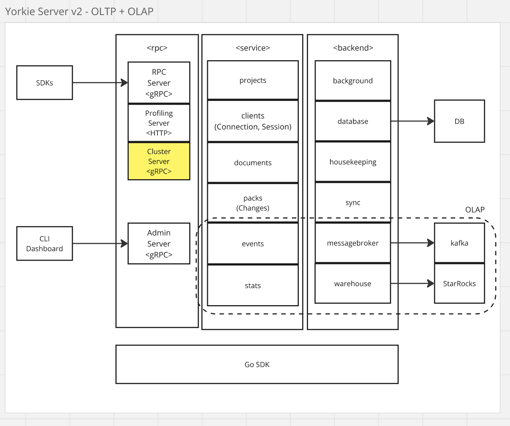

# OLAP Stack for MAU Tracking

## Summary

To accurately measure Monthly Active Users (MAU) for the Yorkie Project, we propose introducing an OLAP stack. This stack will leverage Kafka for event streaming and StarRocks for efficient OLAP query processing. The implementation will enable real-time data aggregation and analytics, providing valuable insights into user activity trends.

## Goals

- Implement a scalable OLAP stack to measure MAU effectively.
- Enable real-time data ingestion and aggregation.
- Ensure efficient querying and analytics using StarRocks.

## Non-Goals

- This proposal does not cover security by storing hashed UserIDs instead of raw identifiers.

## Proposal Details

To integrate OLAP capabilities into Yorkie, we introduce the following components:

### **Architecture Overview**

[](./media/olap-stack.png)

- **Events Package**: Handles event generation and processing from Yorkie clients.
- **Stats Package**: Computes statistical metrics and aggregations.
- **Message Broker**: Uses Kafka to manage real-time event streaming.
- **Warehouse Module**: Stores and processes data in StarRocks for OLAP queries.

### **Client Integration**

Clients will include metadata for user identification:

```javascript
const client = new yorkie.Client("https://api.yorkie.dev", {
  apiKey: "xxxxxxxxxxxxxxxxxxxx", // Identify the project
  metadata: { userID: "user-1234" }, // Identify the user
});
```

#### **Data Flow**

1. Yorkie clients generate events(e.g., client activation, document edits).
2. Events are streamed via Kafka.
3. StarRocks processes and aggregates event data with Routine Load jobs.
4. Precomputed MAU statistics are available for querying.

### Risks and Mitigation

- **High Data Volume**: Implement partitioning and indexing strategies in StarRocks.
- **Security Concerns**: Store only hashed UserIDs to protect user privacy.
- **Scalability**: Use Kafka’s distributed architecture to handle high throughput.

By implementing this OLAP stack, Yorkie will gain a powerful analytics framework to track MAU efficiently and support data-driven decision-making for user activity trends.
