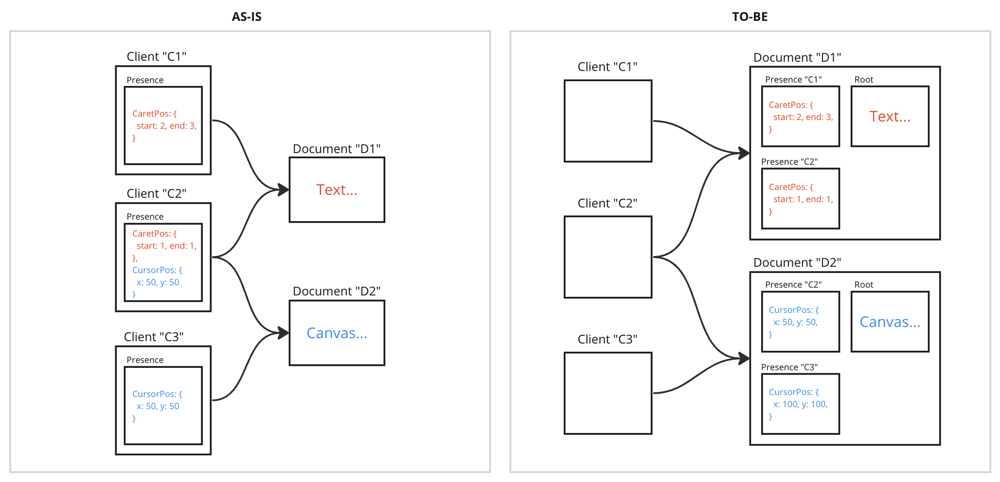
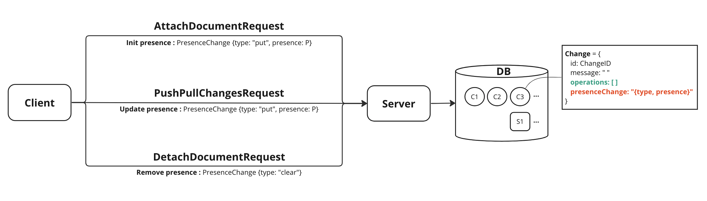
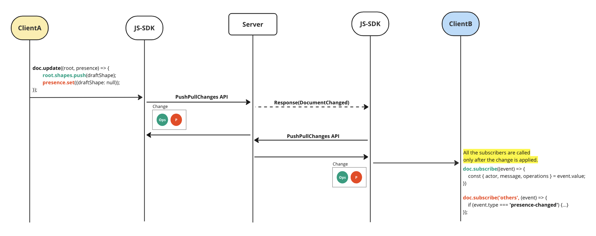
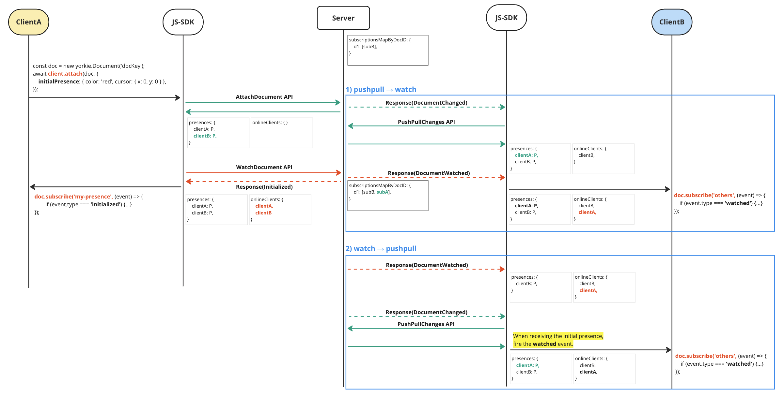
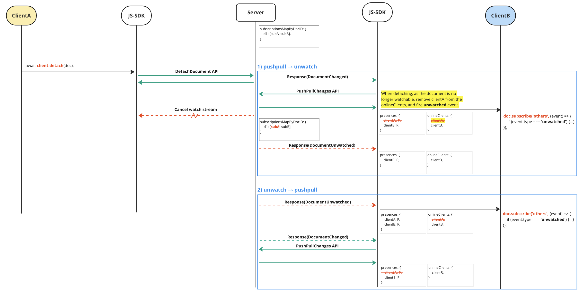

# Presence

## Summary

In collaborative applications, it is important to inform users about who is currently participating in the document and what their status is. To represent this peer awareness, yorkie provides the `Presence` feature. Presence can be used to share state between clients, such as remote cursors, selections, etc. Previously, there was an issue where presence is belong to `Client`, preventing batch processing with `Document`. To address this, presence has been moved from `Client` to `Document`, allowing for batch processing.

### Goals

The goal is to move `Presence` from `Client` to `Document` and enable batch processing with both presence and document.

### Non-Goals

Distinguishing between users who are not participating in document editing and users in an offline state is not covered. Users can only be aware of online peers.

## Proposal details

### Structure Comparison



Previously, presence is belong to `Client`, leading to the following issues:

1. Inefficient management of presences for each document when a client participates in more than one document.
2. Inability to edit presence and document together (no batch processing).

In the new structure, presence is belong to `Document`, and it can be updated together with document updates through `document.update()`, enabling atomic batch processing.

### How to use

#### Set presence

When attaching, the client informs the server that it is subscribing to the document. The `initialPresence` option sets the initial presence of the client. If not set, it is created as an empty object. The presence is shared with other users participating in the document. It must be serializable to JSON.

```typescript
const doc = new yorkie.Document('docKey');
await client.attach(doc, {
  initialPresence: { color: 'blue', cursor: { x: 0, y: 0 } },
});
```

#### Get presence

Only retrieve the presence of online clients.

```typescript
// Get the presence of the current user
doc.getMyPresence(); // { color: 'blue', cursor: { x: 1, y: 1 } }

// Get the presence of the client
doc.getPresence(clientID);

// Get all users currently participating in the document
const users = doc.getPresences();
for (const { clientID, presence } of users) {
  // Do something...
}
```

#### Update presence

Changes specific properties provided to `presence.set()` within `document.update()`. The existing presence object is updated by merging the new changes. In other words, properties not specified will remain unchanged.

Change within the `document.update()` function are processed atomically, and other clients receive a single change. Subscribers are called only after the change is applied.

```typescript
doc.update((root, presence) => {
  presence.set({ cursor: { x: 1, y: 1 } });
});
```

#### Subscribe presence events

`doc.subscribe("presence")` allows subscribing to all presence-related changes. To distinguish between events from oneself and others, `"my-presence"` and `"others"` topics can be used. Subscribing to these events notifies clients when others watch, unwatch, or modify their presence.

When a new client establishes a watch stream connection with a document, it immediately receives an `initialized` event representing all users participating in the document. (Note: Create the document, subscribe, and then attach to receive the initialized event. You won't receive the initialized event if you subscribe after attaching.)

```typescript
const unsubscribe = doc.subscribe('presence', (event) => {
  if (event.type === 'initialized') {
    // Array of users currently participating in the document
  }

  if (event.type === 'watched') {
    // A user has joined the document editing in online
  }

  if (event.type === 'unwatched') {
    // A user has left the document editing
  }

  if (event.type === 'presence-changed') {
    // A user has updated their presence
  }
});

const unsubscribe = doc.subscribe('my-presence', (event) => {
  // evnet.type can be initialized, presence-changed
});

const unsubscribe = doc.subscribe('others', (event) => {
  // evnet.type can be watched, unwatched, presence-changed
});
```

### How does it work?

#### Presence Change

In yorkie, changes to the document are conveyed through a `Change` in the `ChangePack`. To apply changes in the document along with updates to presence, a `PresenceChange` has been included within the `Change`.

```proto
// resources.proto
message Change {
  ChangeID id = 1;
  string message = 2;
  repeated Operation operations = 3;
  PresenceChange presence_change = 4; // this is added
}

message PresenceChange {
  enum ChangeType {
    CHANGE_TYPE_UNSPECIFIED = 0;
    CHANGE_TYPE_PUT = 1;
    CHANGE_TYPE_DELETE = 2;
    CHANGE_TYPE_CLEAR = 3;
  }
  ChangeType type = 1;
  Presence presence = 2;
}

message Presence {
  map<string, string> data = 1;
}
```



When attaching a document, the initial presence is transmitted through `PresenceChange({type: 'put', presence: P})`. When updating presence via `document.update()`, the modified presence is transmitted through `PresenceChange({type: 'put', presence: P})`. When detaching the document, `PresenceChange({type: 'clear'})` is sent to remove the presence. (`P` represents the presence object.)

#### Presence Events

##### `presence-changed` event



When clientA updates presence using `doc.update()`, clientB receives a `presence-changed` event. Modification within the update function are atomic and sent as a single change to other clients, including operations(`Ops`) and presenceChange(`P`). ClientB applies the change and triggers the subscribers only after applying change. If both root changes and presence changes exist, a `remote-change` event occurs, and then the `presence-changed` event occurs.

```typescript
public applyChanges(changes: Array<Change<P>>): void {
  // ...
  for (const change of changes) {
    let changeInfo: ChangeInfo | undefined;
    let presenceEvent: WatchedEvent<P> | UnwatchedEvent<P> | PresenceChangedEvent<P> | undefined;
    // Apply a change
    const opInfos = change.execute(this.root, this.presences);

    // Fire DocEvent only after the change is applied.
    if (changeInfo) {
    	this.publish({
    	  type: DocEventType.RemoteChange,
    	  value: changeInfo,
    	});
    }
    if (presenceEvent) {
    	this.publish(presenceEvent);
    }
  }
}
```

##### `watched` event



When a client attaches to a document, it establishes watch stream connection with the server through the `WatchDocument` API. When the stream disconnects or a new connection is established, `DocumentUnWatched` or `DocumentWatched` event is sent to other clients who are watching the document. (The dotted line represents the watch stream. For information on how the watch stream operates, please refer to the [pub-sub](./pub-sub.md) documentation.)

The client maintains a `presences` map for client presence and an `onlineClients` set for online (watching) clients. The server manages who is watching a document through `subscriptionsMapByDocID`.

When clientA attaches while clientB is already watching the document, two scenarios exist depending on the order of receiving `DocumentChanged` and `DocumentWatched` in the watch stream response:

1. `DocumentChanged(pushpull)` -> `DocumentWatched`
   ClientA attaches, and an initial presence change is sent. Since changes occur in the document, the server informs clientB with `DocumentChanged`. ClientB sends a `pushpullChanges` request, receives clientA's initial presence, and adds it to the `presences` map.
   Once clientA receives the AttachDocument response, it requests a `WatchDocument` API, establishing a watch stream and receiving the list of current document participants(`initalized`). The server notifies clientB that clientA is watching. ClientB adds clientA to the `onlineClients` set and triggers the `watched` event.

2. `DocumentWatched` -> `DocumentChanged(pushpull)`
   If `DocumentWatched` arrives before pushpull response, clientB can't trigger the `watched` event immediately due to the absence of presence data. Later, when `pushpull` delivers clientA's presence, if the presence didn't exist previously, it means that the initial presence was received. In this case, clientB triggers the `watched` event.

```typescript
// client.ts
private handleWatchDocumentsResponse<T, P extends Indexable>(
	attachment: Attachment<T, P>,
  resp: WatchDocumentResponse,
) {
  const pbWatchEvent = resp.getEvent()!;
  const eventType = pbWatchEvent.getType();
  const publisher = converter.toHexString(pbWatchEvent.getPublisher_asU8());
  switch (eventType) {
    // ...
    case PbDocEventType.DOC_EVENT_TYPE_DOCUMENTS_WATCHED:
      attachment.doc.addOnlineClient(publisher);
      // NOTE(chacha912): We added to onlineClients, but we won't trigger watched event
      // unless we also know their initial presence data at this point.
      if (attachment.doc.hasPresence(publisher)) {
        attachment.doc.publish({
          type: DocEventType.Watched,
          value: {
            clientID: publisher,
            presence: attachment.doc.getPresence(publisher)!,
          },
        });
      }
      break;
  }
}


// document.ts
public applyChanges(changes: Array<Change<P>>): void {
  // ...
  for (const change of changes) {
    let changeInfo: ChangeInfo | undefined;
    let presenceEvent: WatchedEvent<P> | UnwatchedEvent<P> | PresenceChangedEvent<P> | undefined;
    const actorID = change.getID().getActorID()!;

    if (change.hasPresenceChange() && this.onlineClients.has(actorID)) {
      const presenceChange = change.getPresenceChange()!;
      switch (presenceChange.type) {
        // ...
        case PresenceChangeType.Put:
          // NOTE(chacha912): When the user exists in onlineClients, but
          // their presence was initially absent, we can consider that we have
          // received their initial presence, so trigger the 'watched' event.
          presenceEvent = {
            type: this.presences.has(actorID)
              ? DocEventType.PresenceChanged
              : DocEventType.Watched,
            value: {
              clientID: actorID,
              presence: presenceChange.presence,
            },
          };
          break;
      }
    }
  }
}
```

##### `unwatched` event



Consider clientA detaching from the document. Similar to the `watched` scenario, two cases exist for the `unwatched` event:

1. `DocumentChanged(pushpull)` -> `DocumentUnWatched`
   ClientA detaches, sending `PresenceChange({type: 'clear'})`. Since the change occurs, the server informs clientB with `DocumentChanged`. ClientB requests a `pushpullChanges`, receives clientA's `PresenceChange({type: 'clear'})`, and removes clientA from the `presences` map. If clientA exists in `onlineClients`, we can consider it as detachment occurring before unwatching. Since detached user is no longer participating in the document, clientB removes clientA from `onlineClients` and triggers the `unwatched` event. Future `unwatched` event is ignored.
2. `DocumentUnWatched` -> `DocumentChanged(pushpull)`
   If clientB receives `DocumentUnWatched` before pushpull response, clientB removes clientA from `onlineClients` and triggers the `unwatched` event. Later, `pushpull` removes clientA's presence from the `presences` map.

```typescript
// client.ts
private handleWatchDocumentsResponse<T, P extends Indexable>(
	attachment: Attachment<T, P>,
  resp: WatchDocumentResponse,
) {
  const pbWatchEvent = resp.getEvent()!;
  const eventType = pbWatchEvent.getType();
  const publisher = converter.toHexString(pbWatchEvent.getPublisher_asU8());
  switch (eventType) {
    // ...
    case PbDocEventType.DOC_EVENT_TYPE_DOCUMENTS_UNWATCHED: {
      const presence = attachment.doc.getPresence(publisher);
      attachment.doc.removeOnlineClient(publisher);
      // NOTE(chacha912): There is no presence, when PresenceChange(clear) is applied before unwatching.
      // In that case, the 'unwatched' event is triggered while handling the PresenceChange.
      if (presence) {
        attachment.doc.publish({
          type: DocEventType.Unwatched,
          value: { clientID: publisher, presence },
        });
      }
      break;
  }
}


// document.ts
public applyChanges(changes: Array<Change<P>>): void {
  // ...
  for (const change of changes) {
    let changeInfo: ChangeInfo | undefined;
    let presenceEvent: WatchedEvent<P> | UnwatchedEvent<P> | PresenceChangedEvent<P> | undefined;
    const actorID = change.getID().getActorID()!;

    if (change.hasPresenceChange() && this.onlineClients.has(actorID)) {
      const presenceChange = change.getPresenceChange()!;
      switch (presenceChange.type) {
        // ...
        case PresenceChangeType.Clear:
          // NOTE(chacha912): When the user exists in onlineClients, but
          // PresenceChange(clear) is received, we can consider it as detachment
          // occurring before unwatching.
          // Detached user is no longer participating in the document, we remove
          // them from the online clients and trigger the 'unwatched' event.
          presenceEvent = {
            type: DocEventType.Unwatched,
            value: {
              clientID: actorID,
              presence: this.getPresence(actorID)!,
            },
          };
          this.removeOnlineClient(actorID);
          break;
      }
    }
  }
}
```

### Risks and Mitigation

- If clients don't explicitly detach, presence can accumulate in the `presences` map. We can handle clearing presence during housekeeping.
- Although presence doesn't need to be stored in the database, it is included in `Change` and stored. Later, we may consider changing the storage approach as data grows. ([Refer to Discord's storage changes.](https://blog.bytebytego.com/i/109085468/how-discord-stores-trillions-of-messages))
  - Client, Document → MongoDB (Document DB or RDB)
  - Change → HBase (Wide column store)
  - Snapshot, Presence → Redis (key-value store, In-memory DB)
