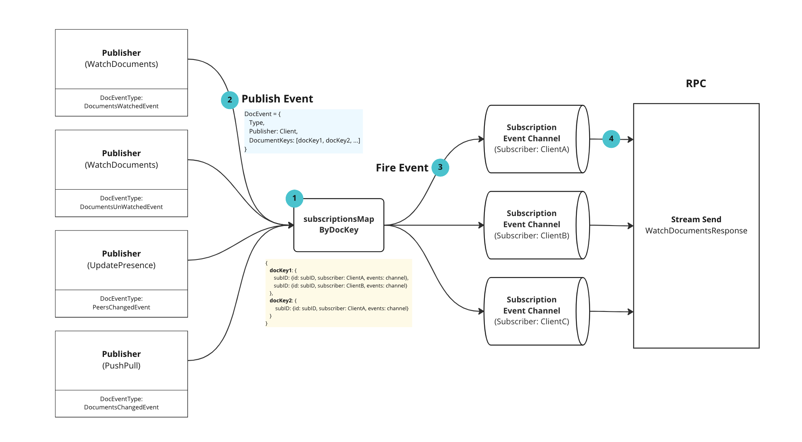

# PubSub

## Summary

Yorkie needs to share events happening in documents with different clients. For
this, we implemented this feature using gRPC server-side stream and the PubSub
pattern.

### Goals

We should be able to share events with other clients who are subscribing to
Documents.

## Proposal Details

### How does it work?

Yorkie implements WatchDocuments API
using [gRPC server-side streaming](https://grpc.io/docs/languages/go/basics/#server-side-streaming-rpc)
to deliver the events that have occurred to other clients.

```protobuf
// api/yorkie.proto

service Yorkie {
    ...
  rpc WatchDocuments (WatchDocumentsRequest) returns (stream WatchDocumentsResponse) {}
}
```

And to manage the event delivery target, we are using the [PubSub pattern](https://en.wikipedia.org/wiki/Publish%E2%80%93subscribe_pattern). You can learn more by looking at the [sync package](https://github.com/yorkie-team/yorkie/blob/main/server/backend/sync/pubsub.go) we are implementing.


The process of the event pub-sub is as follows:


#### 1. Set SubscriptionsMap

The `watchDocuments` API creates a `Subscription` instance and adds it to the `subscriptionsMapByDocKey`. The `Subscription` instance internally manages the `DocEvent channel`, and a `select` statement is used to retrieve events that are passed to the `Subscription` instance.

```go
// Subscription represents a subscription of a subscriber to documents.
type Subscription struct {
	id         string
	subscriber types.Client
	closed     bool
	events     chan DocEvent
}
```

#### 2. Publish Event

The client can send a `DocEvent` to the `Subscription` instances that subscribe to the same document through the `Publish` method.

```go
type DocEvent struct {
	Type         types.DocEventType
	Publisher    types.Client
	DocumentKeys []key.Key
}

Publish(ctx context.Context, publisherID *time.ActorID, event sync.DocEvent)
```

When performing `WatchDocuments`, `UpdatePresence`, and `PushPull`, the `Publish` method is called to deliver the `DocEvent`.

#### 3. Fire Event

The event is sent to the `Subscription` channels that subscribe to the same document by iterating through the `documentKeys` of the `DocEvent`.

```go
func (m *PubSub) Publish(
	ctx context.Context,
	publisherID *time.ActorID,
	event sync.DocEvent,
) {
	m.subscriptionsMapMu.RLock()
	defer m.subscriptionsMapMu.RUnlock()

	for _, docKey := range event.DocumentKeys {
		k := docKey.String()

		if subs, ok := m.subscriptionsMapByDocKey[k]; ok {
			for _, sub := range subs.Map() {
            // If the subscriber is itself, do not send
				if sub.Subscriber().ID.Compare(publisherID) == 0 {
					continue
				}

            // Send the event to the peer's event channel
				sub.Events() <- event
			}
		}
	}
}
```

#### 4. Send response to stream

In the `select` statement from step 1, when the `Subscription` channel receives an event, the event is sent to the `watchDocumentsResponse` of the rpc stream.

```go
func (s *yorkieServer) WatchDocuments(
	req *api.WatchDocumentsRequest,
	stream api.YorkieService_WatchDocumentsServer,
) error {
   // ...
	for {
		select {
		case <-s.serviceCtx.Done():
			return nil
		case <-stream.Context().Done():
			return nil
		case event := <-subscription.Events():
			eventType, err := converter.ToDocEventType(event.Type)

			if err := stream.Send(&api.WatchDocumentsResponse{
				Body: &api.WatchDocumentsResponse_Event{
					Event: &api.DocEvent{
						Type:         eventType,
						Publisher:    converter.ToClient(event.Publisher),
						DocumentKeys: converter.ToDocumentKeys(event.DocumentKeys),
					},
				},
			}); err != nil {
				return err
			}
		}
	}
}
```

### Risks and Mitigation

Currently, Subscription instances are managed in memory. This can be a problem
when building a cluster of servers.  
To solve this problem, we are planning to support cluster-mode
using [etcd](https://github.com/etcd-io/etcd).
