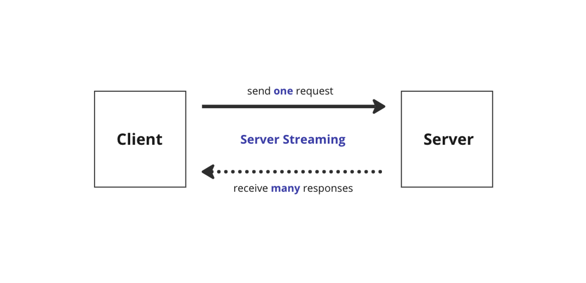

# PubSub

## Summary

Yorkie needs to share events happening in documents with different clients. For
this, we implemented this feature using gRPC server-side stream and the PubSub
pattern.

### Goals

We should be able to share events with other clients who are subscribing to
Documents.

## Proposal Details

### WatchDocument API

In Yorkie, we use gRPC-Web and it currently supports 2 RPC modes: unary RPCs, server-side streaming RPCs. ([Client-side and Bi-directional streaming is not supported.](https://github.com/grpc/grpc-web#streaming-support)). Server-side streaming allows the server to send multiple messages in response to a single client request.



Yorkie implements WatchDocument API using [gRPC server-side streaming](https://grpc.io/docs/languages/go/basics/#server-side-streaming-rpc) to deliver the events to other clients.

```protobuf
// api/yorkie.proto

service Yorkie {
    ...
  rpc WatchDocument (WatchDocumentRequest) returns (stream WatchDocumentResponse) {}
}
```

In brief, when the client sends a WatchDocument request, it establishes a stream connection(1). On the server side, when changes occur in a document, it retrieves the clients watching that document in the subscriptionsMap(2), and then sends responses through the server stream to those clients(3). As a result, clients watching the document can receive response about its changes through the stream without the separate requests.


### How does it work?

We are using the [PubSub pattern](https://en.wikipedia.org/wiki/Publish%E2%80%93subscribe_pattern) for handling event delivery targets. For more details, you can check out the [sync package](https://github.com/yorkie-team/yorkie/blob/main/server/backend/sync/pubsub.go) that we're working on.


The process of the event pub-sub is as follows:


#### 1. Set SubscriptionsMap

The `WatchDocument` API creates a `Subscription` instance and adds it to the `subscriptionsMapByDocID`[(code🔍)](https://github.com/yorkie-team/yorkie/blob/16fd182021231d75562a933cb32d924af16fc7f4/server/rpc/yorkie_server.go#L518-L523). The `Subscription` instance internally manages the `DocEvent channel`.

```go
// Subscription represents a subscription of a subscriber to documents.
type Subscription struct {
	id         string
	subscriber *time.ActorID
	closed     bool
	events     chan DocEvent
}
```

#### 2. Publish Event

When changes occur in a document through WatchDocument or PushPull, the `Publish` method is called to send out a `DocEvent` which includes events such as `DocumentsWatchedEvent`, `DocumentsUnwatchedEvent`, and `DocumentsChangedEvent`.

```go
// server/rpc/yorkie_server.go
func (s *yorkieServer) watchDoc(...) (...) {
	// Publish DocumentsWatchedEvent during watchDocument
	s.backend.Coordinator.Publish(
		ctx,
		subscription.Subscriber(),
		sync.DocEvent{
			Type:       types.DocumentsWatchedEvent,
			Publisher:  subscription.Subscriber(),
			DocumentID: documentID,
		},
	)
}

// server/packs/packs.go
func PushPull(...) (...) {
	// Publish DocumentsChangedEvent during pushpull
	be.Coordinator.Publish(
		ctx,
		publisherID,
		sync.DocEvent{
			Type:       types.DocumentsChangedEvent,
			Publisher:  publisherID,
			DocumentID: docInfo.ID,
		},
	)
}
```

#### 3. Fire Event

The `Publish` method sends a `DocEvent` to the event channel of subscriptions that are subscribing to the document of the `DocEvent`. Through `subscriptionsMapByDocID`, we can find the subscriptions (created in step 1) that are subscribing to a specific document. Subsequently, the `DocEvent` is sent to the event channels of these subscriptions. [(code🔍)](https://github.com/yorkie-team/yorkie/blob/16fd182021231d75562a933cb32d924af16fc7f4/server/backend/sync/memory/pubsub.go#L150-L196).

```go
func (m *PubSub) Publish(
	ctx context.Context,
	publisherID *time.ActorID,
	event sync.DocEvent,
) {
	m.subscriptionsMapMu.RLock()
	defer m.subscriptionsMapMu.RUnlock()

	documentID := event.DocumentID
	if subs, ok := m.subscriptionsMapByDocID[documentID]; ok {
		for _, sub := range subs.Map() {
			// If the subscriber is itself, do not send
			if sub.Subscriber().Compare(publisherID) == 0 {
				continue
			}

			select {
			// Send the event to the peer's event channel
			case sub.Events() <- event:
			}
		}
	}
}
```

#### 4. Send watchDocument response to stream

When the event channel of `Subscription` receives an event, the event is sent to the `WatchDocumentResponse` of the rpc stream. [(code🔍)](https://github.com/yorkie-team/yorkie/blob/16fd182021231d75562a933cb32d924af16fc7f4/server/rpc/yorkie_server.go#L421-L443)

```go
func (s *yorkieServer) WatchDocument(
	req *api.WatchDocumentRequest,
	stream api.YorkieService_WatchDocumentServer,
) error {
	// ...
	for {
		select {
		case <-s.serviceCtx.Done():
			return nil
		case <-stream.Context().Done():
			return nil
		case event := <-subscription.Events():
			eventType, err := converter.ToDocEventType(event.Type)

			if err := stream.Send(&api.WatchDocumentResponse{
				Body: &api.WatchDocumentResponse_Event{
					Event: &api.DocEvent{
						Type:      eventType,
						Publisher: event.Publisher.Bytes(),
					},
				},
			}); err != nil {
				return err
			}
		}
	}
}
```

### Risks and Mitigation

Currently, Subscription instances are managed in memory.
