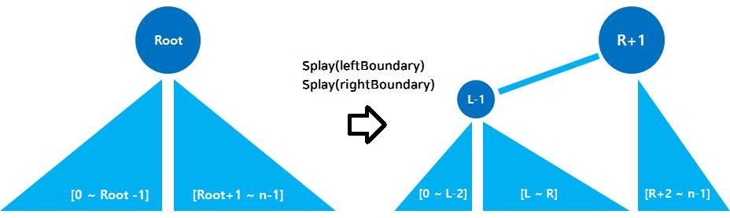
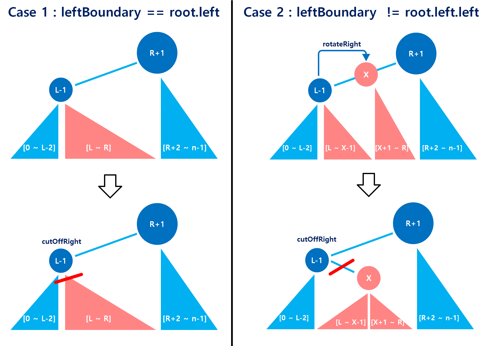
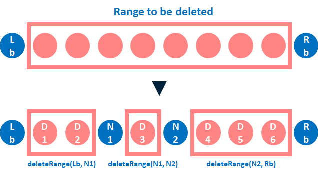

---

# Range Deletion in Splay Tree

## Summary

In the splay tree, access for a node makes the node the root of the tree. So when deleting many nodes like `deleteNodes` in `pkg/json/rga_tree_split.go`, deletion for each node calls many unnecessary `rotation`s.

Using the feature of a splay tree that changes the root freely, `splay.DeleteRange` separates the given range to be deleted as a subtree near the root, without rotations of each node.

### Goals

The function `DeleteRange` should separate all nodes exactly in the given range as a subtree. After executing the function, the entire tree structure and weight of every node must be correct just as when the nodes were deleted one by one.

## Proposal Details



From the property of indexed BST, all nodes with a smaller index than the root are in the left subtree of the root and the nodes with a bigger index are in the right subtree.

And also, Splay Tree can change the root freely to use `Splay`.

Then using the properties, when we want to delete the range from index `L` to `R` we can make the shape of tree like the figure above to `Splay(L-1)` then `Splay(R+1)`.



```go
// see with the figures above
// leftBoundary is indexed L-1 and rightBoundary is indexed R+1.
func (t *Tree[V]) DeleteRange(leftBoundary, rightBoundary *Node[V]) {
  // absence of rightBondary(index R+1) means deletion to the most right of tree.
  if rightBoundary == nil {
    t.Splay(leftBoundary)
    t.cutOffRight(leftBoundary)
    return
  }

  t.Splay(leftBoundary)
  t.Splay(rightBoundary)

  // refer case 2 of second figure
  if rightBoundary.left != leftBoundary {
    t.rotateRight(leftBoundary)
  }
  t.cutOffRight(rightBoundary)
}

```

Sometimes the tree shapes like case 2 after `Splay`s because of the zig-zig case of `Splay`. But it simply changes to the same shapes as case 1 in one rotation for `L-1`.

Then now to cut off the right child(subtree) of `L-1`, we can separate all nodes in the given range to be deleted.

### Risks and Mitigation

`DeleteRange` does not consider the occurrence of new nodes due to concurrent editing in the range to be deleted. They should be filtered before using `DeleteRange`, and `DeleteRange` should be executed continuously in the smaller ranges that do not include them.

The figure and codes below show the situation in which some new nodes `N1` and `N2` are inserted into the range to be deleted concurrently.



```go
func (s *RGATreeSplit[V]) deleteIndexNodes(boundaries []*RGATreeSplitNode[V]) {
  // boundaries = [Lb, N1, N2, Rb]
  for i := 0; i < len(boundaries)-1; i++ {
    leftBoundary := boundaries[i]
    rightBoundary := boundaries[i+1]
    s.treeByIndex.DeleteRange(
      leftBoundary.indexNode,
      rightBoundary.indexNode,
    )
  }
}
```
