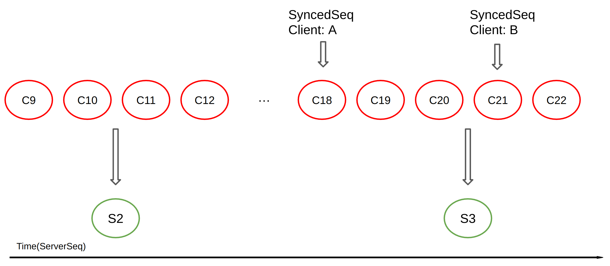

# Retention

This document covers the implementation design of `backend-snapshot-with-purging-changes` flag.

## Summary

In a production environment, it is generally expected to support retention features. This allows users to set the range of data they need and saves storage by deleting data that they don't need. 

To support this feature, we need to implement various features, such as the scope of retention settings (server-level settings, user-level settings, document-level settings, etc.) and the amount or duration of data to be stored.
Currently as a starting point to support these features, the feature to delete changes at the server level is implemented by adding the `--backend-snapshot-with-purging-changes` flag.

This documentation is intended to explain how the `backend-snapshot-with-purging-changes` flag is implemented.

### Goals

Add the `--backend-snapshot-with-purging-changes` flag. If this flag is used, when creating a snapshot, unnecessary changes before the snapshot are deleted. This should not affect synchronization between clients.

### Non-Goals

Since the maximum number of changes that can be deleted are deleted, the number of remaining changes can not be predicted. And inevitably, only available history is output when using the `yorkie history` command. 

## Proposal Details

The --backend-snapshot-with-purging-changes flag was initially suggested in issue #288.
As you can see from the above issue, this is a retention-related option that delete synchronized changes when creating a snapshot.

### Background

The yorkie server basically saves all document changes under the name of change in the DB and delivers these changes to other clients to implement document synchronization.
In addition to this, in order to avoid the problem of synchronizing too many changes one by one, when the number of changes exceeds a certain number(SnapshotInterval), a snapshot is created to record and synchronize the state of the document.

However, due to this structure, all changes of the document are stored in the DB, which has a problem of using a lot of storage space.
To improve this, the `--backend-snapshot-with-purging-changes` flag enables the feature to delete previous changes when a snapshot is created and the document state is recorded.

### How it works?

As you can see from the flag name, this feature deletes the changes before the snapshot when the snapshot is created, but more precisely, it deletes the changes that were synchronized before the snapshot.
This is to avoid the problem of not being synchronized because changes that have not yet been synchronized are deleted. 

To understand this, we need to understand how the server handles changes.

As mentioned in the background above, yorkie assigns ServerSeq to all changes in the document and records them under the name change. 
Here, ServerSeq records the order of changes received by the server in chronological order, and checks how far the synchronization with the client is based on ServerSeq. And the ServerSeq of the confirmed synchronization is recorded in the SyncedSeqs table for each client. 
The Synced ServerSeq recorded here is a value of [initialServerSeq](https://github.com/yorkie-team/yorkie/blob/8ff528083450887190f599efc0b955cb4fae2eef/server/packs/packs.go#L61-L63) when the client and server start syncing. This is to deal with a situation where changes were sent but were missing for some reason.

Therefore, if communication is lost, you can know that you need to apply the changes from the ServerSeq recorded in the SyncedSeq table. 
In conclusion, when a snapshot is created, it should not simply delete the changes before the snapshot, but the changes that have been confirmed to be synchronized(the changes before the minimum ServerSeq that recorded in the SyncedSeq table).

This can be expressed as a picture above(when SnapshotInterval=10, SnapshotThreshold=5). 
Assuming that there are a series of C (changes) in chronological order (ServerSeq), S (snapshots) are being created at intervals of 10 and the synchronized ServerSeq is being recorded in SyncedSeq. At this time, there may be a situation where Client A's synchronization is delayed for some reason. 

In this situation, if all previous Cs are deleted when S3 is created, Client A must pull C19 and C20 for synchronization, but it is already deleted and does not exist. This is the reason why the previous changes are deleted based on the minimum synced ServerSeq in the actual implementation.

### How it was implemented as code

To implement this, we first added the PurgeStableChanges function that deletes changes to the DB when a snapshot is created.

https://github.com/yorkie-team/yorkie/blob/8ff528083450887190f599efc0b955cb4fae2eef/server/backend/database/mongo/client.go#L809-L853

You can see that this is an added function that finds the minimum synced ServerSeq in the SyncedSeq table and deletes the previous changes.

https://github.com/yorkie-team/yorkie/blob/8ff528083450887190f599efc0b955cb4fae2eef/server/packs/snapshots.go#L88-L102

And this function is called when the `--backend-snapshot-with-purging-changes` flag is True in the storeSnapshot function.

https://github.com/yorkie-team/yorkie/blob/8ff528083450887190f599efc0b955cb4fae2eef/server/packs/history.go#L35-L52

The addition of the delete function was completed, but there was one problem when using the yorkie history command. The existing yorkie history command considered all changes to exist, so if the command was used after the changes were deleted, the change could not be found properly and an error occurred.
Therefore, we added a code that finds and limits the printable range so that only existing changes can be printed.

### Future Plan

The current implementation is only capable of deleting synchronized changes when the snapshot is created.. A more detailed retention function needs to be added for future production environments.

To this end, we are considering adding a more detailed retention option by referring to Apache Kafka's log retention option.
More specifically, we want to add a setting for how long changes are kept (year, month, permanent, etc.) and the scope of application of this retention(server-level settings, user-level settings, document-level settings, etc.).