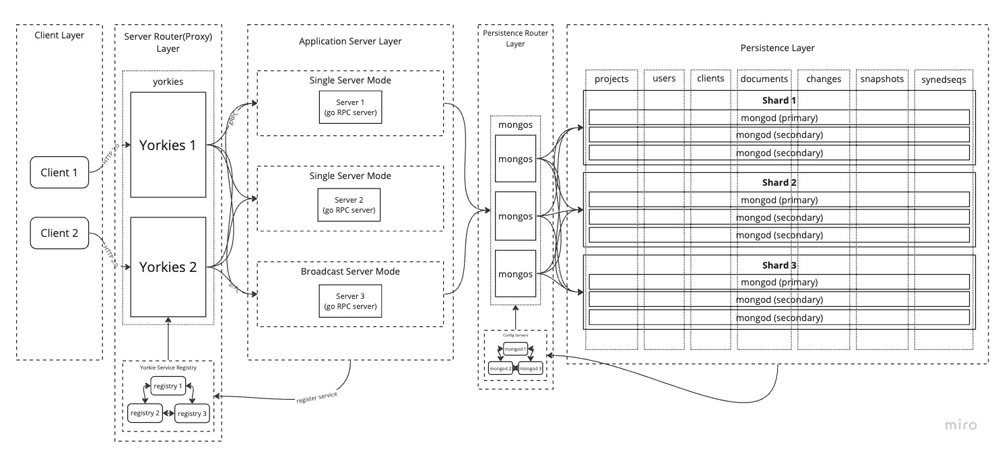

# Shard Cluster Mode

## Summary

In production environment, server clusters are necessary to handle large amount of workloads with ensuring high availability, reliability, and scalability.

Yorkie provides two cluster mode options to support production environment: Broadcast cluster mode and Shard cluster mode.

Broadcast cluster mode is based on broadcasting, pub/sub, and distributed lock between servers. This cluster mode can handle certain amount of workloads, but there are limitations like broadcast, pub/sub, lock overheads to synchronize workloads. Due to these limitations, broadcast cluster mode may not be enough for production mode.

The root cause of these limitations is the fact that because workloads are distributed throughout all server clusters, therefore additional synchronization throughout all servers is needed.

Shard(Lookup-based) cluster mode’s main idea is to assign each server to process same workloads to avoid multiple servers accessing to same data, and put lookup system to route same workloads to same servers.

Shard cluster mode can reduce/remove additional overheads needed for workload synchronization in previous broadcast cluster mode, and become capable of handling large amount of workloads with ensuring high availability, reliability, and scalability.

### Goals

Provide shard cluster mode on server on Kubernetes based production environment.

Also, this document will only explain about core concepts and implementation details of shard cluster mode.

### Non-Goals

Addtional configuration on K8s environment will not be covered in this document.

## Proposal Details

### How does it work?

There are three considerations to be made for designing shard cluster mode.

**Workload Unit**

Shard cluster mode uses `document` as workload unit to assign each server to process same workloads. This assigns and seperates `document`’s state and data to each server, which remove needs for share and sync states and data between server cluster.

**Sharding Strategy**

Shard cluster mode uses [Consistent Hashing](https://en.wikipedia.org/wiki/Consistent_hashing) for server mapping strategy.

Consistent hashing is a technique used to map a range of input values (such as request metadata) to a corresponding range of output values (such as server IDs).

The basic idea of consistent hashing is to assign each server to a point on a circular ring or continuum of hash values. When a request arrives, its hash value is computed, and the server responsible for that hash value is determined by finding the next server on the ring, starting from the point where the hash value falls.

This ensures nearby hash values to be assigned to the same server, providing a degree of consistency in server assignments.


As you can see above, computed hash value is mapped to closest server in clockwise direction, therefore `k0(codepair$xqvlad)` is mapped to `s0(server 0)`. Also, even when `s0` fails, `k0` can be mapped to `s4(server 4)`, this mechanism is helpful when server scale out/scale in, or failover.

Like Ring hash explained above, there is one more consistent hashing based algorithm called Maglev. Maglev is used in Google’s load balancer, and it is more efficient than traditional consistent hashing algorithm.

1. Efficient Load Balancing: Maglev permutates lookup table based on server preference table on index. This makes lookup table to be more even and efficient.
2. Minimal Disruption: Maglev is designed to minimize the number of connections that are disrupted when a server is removed from the pool. 

For more information about Maglev, follow: [Maglev: A Fast and Reliable Software Network Load Balancer](https://ai.google/research/pubs/pub44824)

**LookUp Strategy**

Lookup cluster mode uses server side discovery for lookup strategy.


In server side discovery, there is proxy server(load balancer) in front of services. After services register themselves to service registry, proxy server can get service locations from service registry. Now when client connect to proxy server, proxy server route to proper service based on service registry’s information.

**System Design & Architecture**

Considering all these factors mentioned above, we can now design lookup system architecture.



- `Yorkies`: Yorkies is router(proxy) responsible for two tasks.
    - Routing based on request: Yorkies receives requests from client and route to server based on computed request’s hash key and ring hash algorithm.
- `Yorkie service registry`: Service registry is responsible for storing metadata and configuration settings of yorkie servers just like mongoDB’s config servers.
- `Yorkie Service(s)`: Services to process specific workloads. Here, single Yorkie server is used to process workload.

**Shard Cluster Mode Implementation (K8s & Istio)**

Shard cluster mode can be easily implemented by using [Kubernetes](https://kubernetes.io/) and [Istio](https://istio.io/). Kubernetes is container orchestration system, and Istio is service mesh for Kubernetes.


By using K8s and Istio, `Yorkies` can be implemented with Istio's Ingress Gateway(envoy), and `Yorkie service registry` can be implemented with Istio Pilot.

When Yorkie server pods are deployed, Kubernetes registers them to service registry(etcd) and Istio Pilot can get service locations from service registry. After that, Istio Ingress Gateway(envoy) can route to proper service based on service registry’s information retrieved from Istio Pilot.

By using Istio's `Gateway`, `VirtualService`, and `DestinationRule` resources, we can configure Istio Ingress Gateway(envoy) to route requests to proper service. Especially, `consistentHash` in `DestinationRule` can be used to route requests based on computed request’s hash key and consistent hashing algorithm.

Here is an example of `DestinationRule` resource.

```yaml
apiVersion: networking.istio.io/v1alpha3
kind: DestinationRule
metadata:
  name: yorkie
spec:
  host: yorkie
  trafficPolicy:
      portLevelSettings:
      - port:
          number: 11101
        loadBalancer:
          consistentHash:
            ringHash:
              minimumRingSize: 1024
            httpHeaderName: "x-shard-key"
...
```

In this configuration, `consistentHash` is configured to use `ringHash` algorithm with `minimumRingSize` of `1024`. This will be used to route requests based on computed request’s hash key and ring hash algorithm with size of `1024` virtual nodes. 

```yaml
...
loadBalancer:
  consistentHash:
    maglev:
      tableSize: 65537
    httpHeaderName: "x-shard-key"
```

We can also use `Maglev` algorithm by using `maglev` instead of `ringHash`. This will be used to route requests based on computed request’s hash key and Maglev algorithm with size of `65537` lookup table.

Also, `httpHeaderName` is used for hash function parameter. This routes workload based on http header’s value. For example, using `x-shar-key` seperates workloads in `project/document` unit.

### Risks and Mitigation

Hash-based load balancing is good way to shard workloads to servers, but it has some risks.

**WatchDocument's Split Brain Issue on Hash-based LB**

WatchDocument uses gRPC's server side streaming based on long-lived connection of HTTP 2.0.

When server is added or removed from the cluster, all requests will re-routed to new server. However, long-lived connection like WatchDocument will keep connected to old server, not be re-routed to new server. We can call this issue, a split brain issue on long-lived connection.

Below explains how split-brain of connection occurs.


To mitigate this issue, we can use various methods.

- gRPC Max Connection Age & Max Connection Age Grace: gRPC provides `MaxConnectionAge` and `MaxConnectionAgeGrace` options to close long-lived connection. We can use this option to explicitly close long-lived connection perioadically, and ensure that connection is re-routed to new server after some period.
- envoy Stream Idle Timeout: envoy provides `stream_idle_timeout` option to close long-lived connection. We can use this option to explicitly close long-lived connection when connection is idle, and ensure that connection is re-routed to new server. This is because connections will be idle when split-brained.
