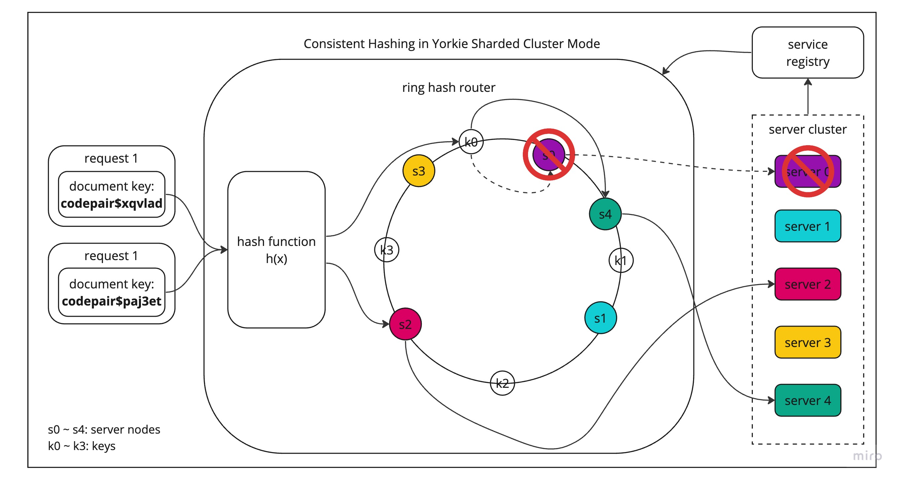
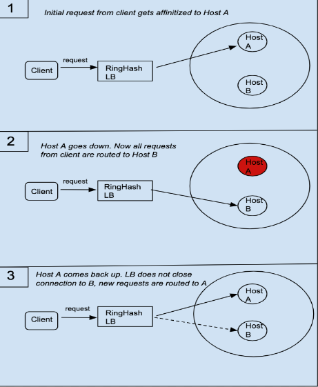

# Sharded Cluster Mode

## Summary

In production environment, server cluster is necessary to handle large amount of workloads with ensuring high availability, reliability, and scalability.

Yorkie provided Broadcast cluster mode to support production environment.

Broadcast cluster mode is based on broadcasting, pub/sub, and distributed lock between servers. This cluster mode can handle certain amount of workloads, but there are limitations like broadcast, pub/sub, lock overheads to synchronize workloads. Due to these limitations, broadcast cluster mode may not be enough for production mode.

The root cause of these limitations is that workloads are distributed throughout the servers in the cluster, additional synchronization is needed.

Sharded(Lookup-based) cluster mode’s main idea is to assign each server to process same workloads to avoid multiple servers accessing to same data, and put lookup system to route same workloads to same servers.

Sharded cluster mode can reduce/remove additional overheads needed for workload synchronization in previous broadcast cluster mode, and become capable of handling large amount of workloads with ensuring high availability, reliability, and scalability.

### Goals

Provide sharded cluster mode on server on Kubernetes based production environment.

### Non-Goals

This document will only explain about core concepts and implementation of sharded cluster mode. Addtional configuration on K8s/Istio environment will not be covered in this document.

## Proposal Details

### How does it work?

There are three aspects to be considered for designing sharded cluster mode.

**Workload Unit**

Sharded cluster mode uses `document` as workload unit to assign each server to process same workloads. This assigns and seperates `document`’s state and data to each server, which remove needs for share and sync states and data between server cluster.

**Sharding Strategy**

Sharded cluster mode uses [Consistent Hashing](https://en.wikipedia.org/wiki/Consistent_hashing) for sharding strategy.

Consistent hashing is a technique used to map a range of input values (such as request header) to a corresponding range of output values (such as server IDs).

The basic idea of consistent hashing is to assign each server to a point on a circular ring or continuum of hash values. When a request arrives, its hash value is computed, and the server responsible for that hash value is determined by finding the next server on the ring, starting from the point where the hash value falls.

This ensures nearby hash values to be assigned to the same server, providing a degree of consistency in server assignments.



As you can see above, computed hash value is mapped to closest server in clockwise direction, therefore `k0(codepair$xqvlad)` is mapped to `s0(server 0)`.

Also, even when `s0` fails, `k0` can be mapped to `s4(server 4)`, and other mapping does not change. This mechanism is called _minimal disruption_, and consistening hashing ensures that only `key/number_of_backends` are remapped when upstream host set changes.

What we explained above is called `Ring hash` algorithm. Using ring hash based load balancing ensures session affinity between requests from specific workload(`document`) and upstream host(`yorkie server`).

Also, there is another consistent hashing based algorithm called `Maglev`. Maglev is used in Google’s load balancer, and it is more efficient than traditional consistent hashing algorithm.

Maglev ensures minimal disruption like Ring hash. But unlike Ring hash, Maglev also ensures even load balancing(Efficient LB) by using preference list permutation and lookup table population.

This is because Ring Hash always recalculates hash table whenever there are changes in upstream hosts, but Maglev only recaulcates preference list for changed host, and repopulate only the changes made in preference list to lookup table. This makes Maglev more efficient than Ring hash on rehashing calculation.

Sharded cluster mode in Yorkie supports both Ring hash and Maglev algorithm for hash-based sharding.

For more information about Maglev, follow: [Maglev: A Fast and Reliable Software Network Load Balancer](https://ai.google/research/pubs/pub44824)

**LookUp Strategy**

Lookup cluster mode uses server side discovery for lookup strategy.


In server side discovery, there is proxy server(load balancer) in front of services. After services register themselves to service registry, proxy server can get service locations from service registry. Now when client connect to proxy server, proxy server route to proper service based on service registry’s information.

**System Design & Architecture**

Considering all these factors mentioned above, here is a architecture for sharded cluster.


There are only three components needed for implementing sharded cluster.

- `Yorkies`: Yorkies is router(proxy) responsible for two tasks.
  - Routing based on request: Yorkies receives requests from client and route to server based on computed request’s hash key and ring hash algorithm.
- `Yorkie Service Registry`: Service registry is responsible for storing metadata and configuration settings of yorkie servers just like mongoDB’s config servers.
- `Yorkie Service(s)`: Services to process specific workloads. Here, single Yorkie server is used to process workload.

These components are very similiar to mongoDB's sharding component, which `Yorkies` corresponds to `mongos(Router)`, `Yorkie Service Registry` with `config server(Registry)`, and `Yorkie Service(s)` with `mongod(Shard)`

**Sharded Cluster Mode Implementation (K8s & Istio)**

Sharded cluster mode can be easily implemented by using [Kubernetes](https://kubernetes.io/) and [Istio](https://istio.io/). Kubernetes is container orchestration system, and Istio is service mesh for Kubernetes which internally uses [envoy](https://github.com/envoyproxy/envoy) L7 proxy for traffic control.


By using K8s and Istio, `Yorkies` can be implemented with `Istio Ingress Gateway(envoy)`, and `Yorkie service registry` can be implemented with `Istio Pilot`.

When Yorkie server pods are deployed, Kubernetes registers them to `service registry(etcd)` and `Istio Pilot` can get service locations from service registry. After that, `Istio Ingress Gateway(envoy)` can route to proper service based on service registry’s information retrieved from `Istio Pilot`.

By using Istio's `Gateway`, `VirtualService`, and `DestinationRule` resources, we can configure `Istio Ingress Gateway(envoy)` to route requests to proper service. Especially, `consistentHash` option in `DestinationRule` can be used to route requests based on computed request’s hash key and consistent hashing algorithm.

Here is an example of `DestinationRule` resource.

```yaml
apiVersion: networking.istio.io/v1alpha3
kind: DestinationRule
metadata:
  name: yorkie
spec:
  host: yorkie
  trafficPolicy:
    portLevelSettings:
      - port:
          number: 11101
        loadBalancer:
          consistentHash:
            ringHash:
              minimumRingSize: 1024
            httpHeaderName: "x-shard-key"
```

In this configuration, `consistentHash` is configured to use `ringHash` algorithm with `minimumRingSize` of `1024`. This will be used to route requests based on computed request’s hash key and ring hash algorithm with size of `1024` virtual nodes.

```yaml
---
loadBalancer:
  consistentHash:
    maglev:
      tableSize: 65537
    httpHeaderName: "x-shard-key"
```

We can also use `Maglev` algorithm by using `maglev` instead of `ringHash`. This will be used to route requests based on computed request’s hash key and Maglev algorithm with size of `65537` lookup table.

For hash function parameter in load balancing, `httpHeaderName` is used. This routes workload based on http header’s value. For example, using `x-shard-key` seperates workloads in `project/document` unit.

### Risks and Mitigation

There are some risks and considerstions in sharded cluster mode.

**WatchDocument's Split Brain Issue on Hash-based LB**

`WatchDocument` uses gRPC's server side streaming based on long-lived connection of HTTP 2.0.

When server is added or removed from the cluster, all requests will re-routed to new server. However, long-lived connection like `WatchDocument` will keep connected to old server, and not re-routed to new server. We call this issue, a _split brain_ issue of long-lived connection.

Below explains how split-brain of long-lived connection occurs.



For now, we can mitigate this issue with following solutions.

- gRPC `Max Connection Age` & `Max Connection Age Grace`: gRPC provides `MaxConnectionAge` and `MaxConnectionAgeGrace` options to close long-lived connection. We can use this option to explicitly close long-lived connection perioadically, and ensure that connection is re-routed to new server after some period.
- envoy `Stream Idle Timeout`: envoy provides `stream_idle_timeout` option to close long-lived connection. We can use this option to explicitly close long-lived connection when connection is idle, and ensure that connection is re-routed to new server. This is because connections will be idle when split-brained.

Above solutions are forceful way to close long-lived connection, so it is not a perfect solution. We will introduce graceful way to close long-lived connection using `GOAWAY` frame of HTTP 2.0 in further updates.

**Housekeeping in Sharded Cluster Mode**

When we use server cluster, we are performing housekeeping on every server in the cluster. But this is not a efficient way to perform housekeeping, because all the servers are performing redundant housekeeping on same data that is already housekeeped by other servers.

There are two options to solve this problem:

1. Only the master server executes housekeeping in the cluster
2. Split housekeeping tasks per project and execute them on servers mapped by project

For now, we are using option 1(only the master server executes housekeeping in the cluster), with leader election for electing master server for simplicity. However, we will use option 2 in further updates.
