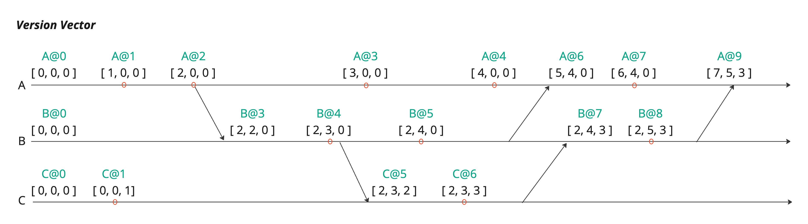
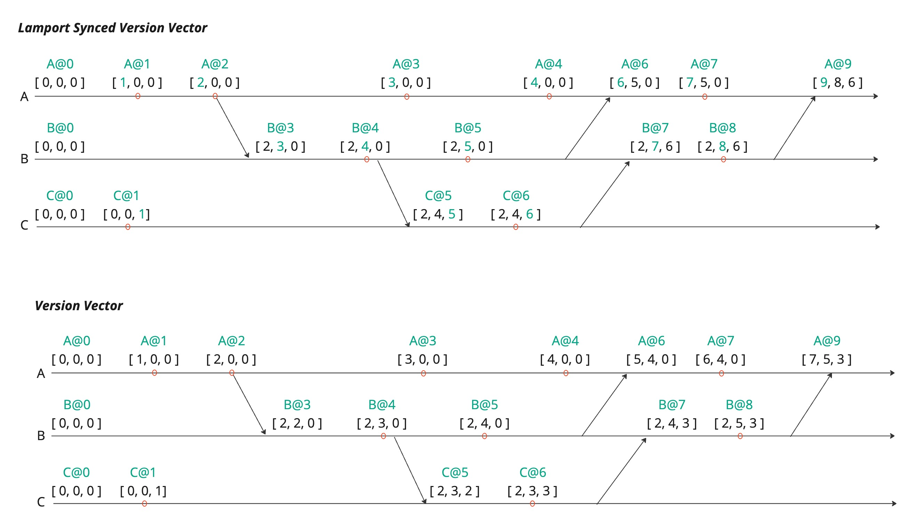

# Version Vector
## Summary

In CRDT systems, logical clocks are crucial for maintaining consistency and resolving conflicts across distributed nodes. Since physical time can vary between nodes, logical clocks like Lamport or Version Vector track the order of events, ensuring that updates are merged correctly without conflicts. They help determine the sequence of modifications, identify causal relationships between events, and facilitate conflict resolution. By providing a reliable mechanism to manage data synchronization and merge operations, logical clocks ensure that CRDT systems can maintain consistency even in asynchronous, distributed environments.

Yorkie provides a special type of Version Vector called Lamport Synced Version Vector which consists of Lamport and version vector.

### Goal

Introduce yorkie's logical clock system.

### Non Goals

This document will not explain how CRDT works and Yorkie's document structure.

## Proposal Details

### What is Lamport Timestamp
`Lamport Timestamps` are a logical clock mechanism used in distributed systems to order events without relying on synchronized physical clocks. Each process in the system maintains a counter that increments with every event, and when a process sends a message, it includes its current counter value. Upon receiving a message, the recipient updates its own counter to the maximum of its current value or the received timestamp, ensuring a consistent ordering of events. `Lamport Timestamps` provide a way to determine the "happened-before" relationship between events, helping in coordinating actions in a distributed environment.
```
Here's a simplified example of Lamport Timestamps in a distributed system with three processes (P1, P2, P3):

1. P1 performs an event: P1's clock becomes 1.
2. P1 sends a message to P2: P1 increments its clock to 2 and sends the message with timestamp 2.
3. P2 receives the message: P2 updates its clock to max(0, 2) + 1 = 3.
4. P2 sends a message to P3: P2's clock becomes 4.
5. P3 receives the message: P3 updates its clock to max(0, 4) + 1 = 5.
6. P3 sends a message to P1: P3's clock becomes 6.
7. P1 receives the message: P1 updates its clock to max(2, 6) + 1 = 7.
8. The timestamps help order events across processes even without synchronized physical clocks.
```

### Brief Explain of Yorkie's Logical Clock System
All updates are recorded as `change`, and the ID of the `change` is composed of a `Lamport Timestamp` and `actorID` called `TimeTicket`. The ID of each CRDT node created through `changes` is also composed of a `TimeTicket`.

### The reason for choosing Version Vector To Replace Lamport Based Logical Clock System
Yorkie provides Garbage Collection for removed (tombstone) nodes. The previously implemented Lamport-based ID system triggers a crucial problem with causality.
You can see detail from [garbage collection design document](./garbage-collection.md).

### What is Version Vector

A Version Vector is a mechanism used in distributed systems to track the causal relationships between different replicas or nodes. Each node maintains a vector, where each element corresponds to a version counter for every other node in the system, including itself. Whenever a node updates its state, it increments its own counter. When nodes exchange information, they merge their vectors by taking the maximum value for each element, ensuring that the system knows which updates happened concurrently or which one came first. Version Vectors are particularly useful for detecting conflicts and maintaining consistency in distributed databases by providing a more detailed view of the system's state than a single logical clock.



### Inconsistency of Lamport and Version Vector

As explained above, Lamport Timestamps increase their max value with each merge, while Version Vectors do not. Version Vectors simply take the maximum value of the elements received, without creating a new max by adding to the maximum found during the merge process.

As previously mentioned, both CRDT node IDs and change IDs were composed of `TimeTickets`, which led to garbage collection (GC) issues. If we attempt to resolve causality problems by applying Version Vectors to change IDs, it would require converting all corresponding CRDT node IDs from Lamport-based to Version Vector-based. This introduces memory overhead proportional to the number of participants, as Version Vectors consist of (ID, counter) pairs for all participants involved in the edits, leading to increased memory usage and computational complexity.

To address the issues that arise from introducing Version Vectors, we implemented a method that synchronizes Lamport Timestamps with Version Vectors, allowing both to be used together. This way, CRDT nodes continue to use `TimeTickets` as their IDs, while change IDs utilize the Lamport Synced Version Vector.

### What is Lamport Synced Version Vector
The Lamport Synced Version Vector is a combination of Lamport Timestamps and Version Vectors. From now on, we will refer to this as the Version Vector.

This Version Vector, like the traditional Version Vector, is composed of (key, value) pairs. The difference is that the value is a Lamport Timestamp, and during the merge process, the value at each position is updated in the same way as in a Lamport merge.

Let's take a closer look at the diagram below.

The lower part of the diagram shows an example of a conventional version vector. In the merge process, the receiver always retains the value corresponding to its own key. However, in the upper part of the diagram, which illustrates a Lamport Synced Version Vector, we can observe that the Lamport timestamp of the change ID and the value for the receiver's own key in the version vector are always identical. When merging the two versions, the maximum value is taken through a max operation, and by incorporating the Lamport merge method into this process, synchronization can be achieved. This ensures that causality is always satisfied, allowing the existing TimeTicket system to be used together with the version vector.