# Presenceless Document Option

## Summary

Yorkie stores document presence as document-scoped metadata so that
participants can share awareness information such as cursors,
selections, and user status. While this behavior is essential for
collaborative editors, not every document benefits from presence.

Some documents, such as counters, primitive values, or shared metadata,
never expose awareness information to users. For these documents,
persisting presence creates unnecessary storage overhead and increases
the amount of data transferred during synchronization.

This proposal introduces a document-scoped `disable_presence` option.
Once a document is created with this option enabled, the server
permanently disables presence storage and propagation for that document.
All subsequent clients automatically follow the persisted behavior,
regardless of the options they request locally.

---

## Problem

Presence is stored as a document-wide map in `DocInfo`. Every attached
client contributes an entry to this shared map.

For documents that never consume presence information, this behavior
creates unnecessary overhead. Even though the application never uses
presence, the server still stores it, synchronizes it, and includes it
in subsequent attach responses.

This becomes particularly problematic when clients disconnect
unexpectedly without sending `DetachDocument`. Stale presence entries
remain until housekeeping removes them, causing the shared presence map
to continue growing over time.

In a representative production sample, a document whose CRDT root
occupied only **155 bytes** accumulated nearly **800 KB** of serialized
presence data after several hours, making presence significantly larger
than the document itself.

A client-side opt-out alone cannot solve this problem. Presence belongs
to the document rather than to individual clients, meaning that any
client attaching without the option—whether due to an older SDK or a
misconfiguration—can repopulate the shared presence map.

To permanently eliminate unnecessary presence storage, the decision must
be owned by the document itself and enforced consistently by the server.

### Goals

This proposal aims to:

- Allow a document to permanently opt out of presence storage.
- Persist the decision as document metadata.
- Enforce the persisted behavior for every subsequent attachment and
  synchronization.
- Prevent stale or abandoned clients from polluting presence data.
- Preserve existing behavior for documents that continue using presence.

### Non-Goals

This proposal does **not** attempt to:

- Disable presence at the project level. Presence is managed per
  document through `DocInfo`, making the document the correct ownership
  boundary.
- Automatically detect documents that do not require presence.
- Support changing a document's presence behavior after creation.
- Modify the existing presence model for ordinary collaborative
  documents.

---

## Proposal Details

This proposal introduces a new document creation option:

```go
client.Attach(ctx, doc, client.WithDisablePresence())
```

When the first client creates a document with
`disable_presence = true`, the server persists the decision as part of
the document metadata.

After the document has been created:

- every client observes the persisted value;
- the server ignores conflicting client requests;
- presence is never stored;
- presence updates are never synchronized.

Unlike a client preference, `disable_presence` becomes part of the
document's permanent behavior.

---

## How to Use

### Creating a Presenceless Document

A document becomes presenceless only when it is first created with the
option enabled.

```go
doc := document.New("counter")

err := client.Attach(
    ctx,
    doc,
    client.WithDisablePresence(),
)
```

The server persists this decision when the document is created.

### Attaching Existing Documents

For existing documents, the persisted value always takes precedence over
the client request.

Even if a later client omits `WithDisablePresence()`, the server returns
the persisted value during `AttachDocument`, and the SDK automatically
adopts the document's behavior.

This guarantees that all clients observe the same presence policy and
prevents a single outdated or misconfigured client from accidentally
reintroducing presence.

## How does it Work?

The `disable_presence` option affects both document creation and every
subsequent synchronization. Once a document is created as
presenceless, the server treats that property as immutable and applies
it consistently across attachment, synchronization, and snapshot
generation.

The overall flow is illustrated below.

```mermaid
flowchart LR

A[Client Attach<br/>disable_presence=true]
    --> B[AttachDocument]

B --> C[Create DocInfo]

C --> D[Persist DisablePresence]

D --> E[AttachDocumentResponse]

E --> F[Client adopts persisted value]

F --> G[PushPull]

G --> H[Strip Presence Changes]

H --> I[Generate Snapshot]

I --> J[Reset Presences]

J --> K[Client receives pack without presence]
```



### Contract

A document becomes presenceless only when it is first created with
`disable_presence = true`.

After creation:

- the persisted value is stored in `DocInfo.DisablePresence`;
- every later attachment observes the persisted value;
- conflicting client requests are ignored;
- presence is never persisted or synchronized.

This contract is immutable. There is no migration or runtime toggle.

### Wire Protocol

The attach request allows a client to request a presenceless document.

```protobuf
message AttachDocumentRequest {
  bool disable_presence = 5;
}
```

The server always returns the persisted value.

```protobuf
message AttachDocumentResponse {
  bool disable_presence = 5;
}
```

Clients therefore synchronize against the document's actual policy
instead of the value they originally requested.

---

### Document Creation

During the first `AttachDocument`, the server persists the
`disable_presence` option together with the document metadata.

The value is written only when the document is created.

MongoDB performs this through `$setOnInsert`, while the in-memory
backend performs the equivalent insert-only initialization.

Because the value is only written during creation, ownership of the
decision belongs to the document itself rather than to individual
clients.

Subsequent attachments never overwrite the persisted value.

---

### Synchronization

Once a document is marked as presenceless, every synchronization uses
the persisted value carried through `PushPullOptions`.

Presence is removed at three independent stages.

#### Incoming Changes

Before incoming changes are persisted,
`stripPresenceChanges()` removes all presence information.

- Presence-only changes are discarded.
- Mixed operation/presence changes retain their document operations
  while removing only the presence update.

This prevents clients from introducing new presence data into the
document.

#### Pulled Changes

When previously stored changes are read back from storage, any
remaining `PresenceChange` is removed before the response is sent.

If removing the presence update leaves an otherwise empty change, the
entire change is discarded.

This guarantees that clients never receive presence updates for a
presenceless document.

#### Snapshot Generation

Snapshot generation clears presence immediately before serialization.

The server calls `doc.ResetPresences()` before building the response
snapshot.

The same reset is performed again before writing a snapshot into the
snapshot store.

Although this appears redundant, the second reset protects against
cached in-memory presence that may have been reconstructed while
processing previous changes.

Together, these checks ensure that snapshots never contain presence
data.

---

### Client Behavior

After a successful attachment, the client adopts the persisted value
returned by the server rather than the option originally requested.

This guarantees that all clients eventually behave consistently,
regardless of SDK version or local configuration.

Once the document is recognized as presenceless, the SDK suppresses
presence throughout its lifecycle.

#### Attach

The client skips the initial `Presence.Initialize()` step.

As a result, attaching a presenceless document never generates the
automatic initial `PUT` presence change that ordinary documents
produce.

#### Update

During `Document.Update()`, any generated presence change is discarded.

If the update only modified presence, no change is produced and the SDK
returns without sending anything to the server.

If document operations and presence updates are mixed together, the
document operations are preserved while only the presence update is
removed.

#### Synchronization

The SDK derives its behavior from
`AttachDocumentResponse.DisablePresence`.

Even if a client attaches without
`WithDisablePresence()`, it immediately adopts the persisted server
policy and suppresses future presence updates.

A single outdated or misconfigured client therefore cannot
reintroduce presence into a presenceless document.

---

### Verification

The implementation is covered by integration and unit tests.

The tests verify:

- persistence through first attachment;
- immutable document behavior;
- warning (rather than rejection) for conflicting attach requests;
- stripping of presence from incoming and outgoing synchronization;
- snapshot generation without presence;
- client-side suppression of presence-only updates;
- preservation of document operations when mixed with presence updates.

## Design Decisions

### Why document-scoped instead of client-scoped?

Presence is stored as document metadata rather than client metadata.

A client-scoped opt-out cannot prevent another client from creating or
updating presence for the same document. As long as any participant
continues sending presence updates, the shared presence map grows.

Making the option document-scoped allows the server to enforce a single,
consistent policy for every client.

---

### Why is the option immutable?

`disable_presence` is persisted only when a document is created.

Allowing the value to change later would require invalidating cached
presence state, synchronizing the transition across servers, and
handling clients that are already attached.

Keeping the option immutable avoids these coordination problems and
allows the document's behavior to remain deterministic throughout its
lifetime.

---

### Why does the server return the persisted value?

The attach request expresses the client's preference.

The attach response communicates the document's actual behavior.

Returning the persisted value ensures that every client eventually
adopts the same policy, regardless of SDK version or local
configuration.

---

### Why strip presence on both write and read paths?

Presence can enter the synchronization pipeline through multiple paths.

Removing presence only when receiving client requests would still allow
previously persisted or cached presence to appear in outgoing responses.

For this reason the server validates every stage independently:

- incoming changes;
- pulled changes;
- snapshot generation.

This defense-in-depth approach guarantees that presence never leaks back
to clients after a document becomes presenceless.

---

## Alternatives Considered

### Client-only opt-out

A client-only option cannot prevent another participant from sending
presence updates.

Since presence is shared by every participant in the document, the
server must own the enforcement.

---

### Project-scoped option

Presence belongs to individual documents rather than projects.

Some documents within the same project may require collaborative
presence while others do not.

Using the project as the configuration boundary would therefore be
either too broad or too restrictive.

---

### Runtime toggle

Changing the behavior of an existing document would require cache
invalidation, cluster-wide coordination, and migration of existing
presence state.

The additional complexity outweighs the operational benefit.

---

### Improved detach handling

Improving client-side detach behavior reduces stale presence but does
not eliminate unnecessary presence generated by documents that never use
the feature.

This proposal removes the source of unnecessary presence rather than
improving cleanup afterward.

---

## Recommended Use Cases

The `disable_presence` option is intended for documents whose
collaboration model does not require participant awareness.

Suitable use cases include:

| Recommended | Reason |
|-------------|--------|
| Counter documents | No participant awareness required |
| Primitive CRDT documents | Presence provides no additional value |
| Shared configuration or metadata | Synchronization only, no collaboration UI |
| Background synchronization documents | Presence would never be displayed |

The option is **not** recommended for:

| Not Recommended | Reason |
|-----------------|--------|
| Collaborative editors | Remote cursors and user awareness require presence |
| Whiteboards | Users expect live participant information |
| Applications showing online participants | Presence is part of the product behavior |

---

## Risks and Mitigation

| Risk | Mitigation |
|------|------------|
| Client attaches without `WithDisablePresence()` | Server returns the persisted value and the SDK adopts it automatically. |
| Presence reaches storage through synchronization | Presence is removed before persistence. |
| Cached presence appears in snapshots | Presence is cleared immediately before both response serialization and snapshot persistence. |
| Mixed operation and presence updates | Operations are preserved while only presence is removed. |
| Conflicting attach requests | The server logs a warning and continues enforcing the persisted document policy. |

---

## Future Work

The current design intentionally keeps `disable_presence`
simple and immutable.

Future improvements may include:

- migration tooling for legacy documents;
- operational metrics for presenceless documents;
- storage optimization for documents that permanently disable presence.

These enhancements can be added without changing the document contract
defined by this proposal.

---

## Tasks

Implementation tasks are tracked separately under
`docs/tasks/active/`.