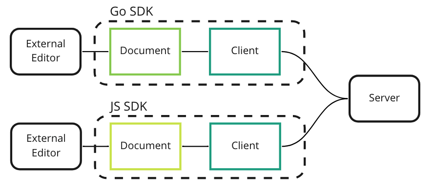
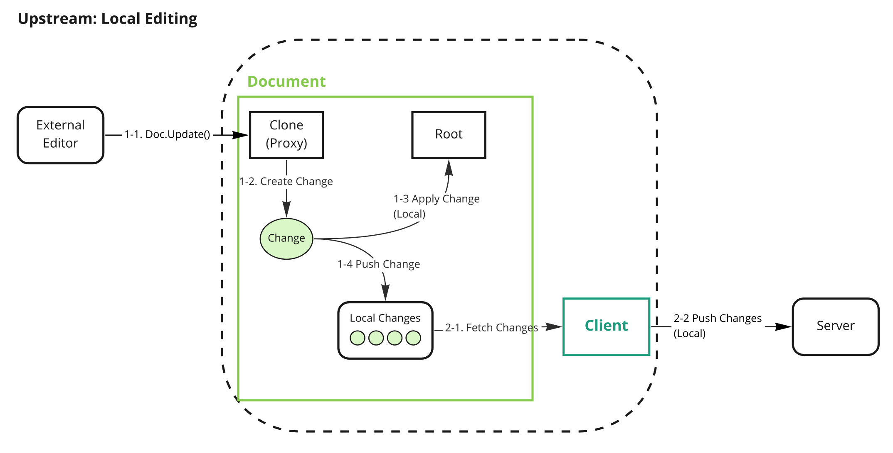
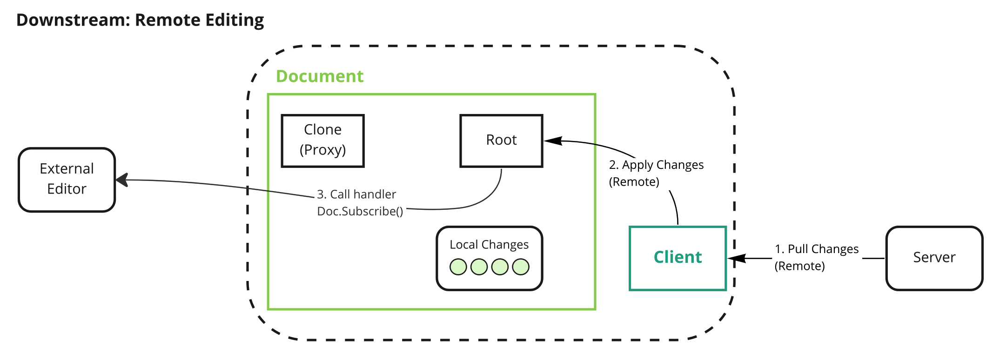

# Document Editing

This document covers document editing executed in the SDK.

## Summary

Document Editing is a mechanism to modify the document. It consists of two parts, **Local** and **Remote**.
We will provide a simple document editing example in the SDK to show how it works.

### Goals

The purpose of this document is to help new SDK contributors to understand the SDK's editing behavior.

### Non-Goals

This document does not describe algorithms such as CRDTs or logical clocks.

## Proposal Details

First, we briefly describe `Client` and `Document` and then explain what happens inside the Client and Document when editing a document.

### Overview

A high-level overview of Yorkie is as follows:



A description of the main components is as follows:

- `SDK` consists of `Client` and `Document`.
- `Client`: A `Client` is a normal client that can communicate with `Server`. Changes on a `Document` can be synchronized by using a `Client`.
- `Document`: A Document is a CRDT-based data type through which the model of the application is represented.
- `Server`: A `Server` receives changes from `Client`s, stores them in the DB, and propagates them to `Client`s who subscribe to `Document`s.

Next, we will look at how `Client` and `Document` described in Overview work when editing a `Document`.

Editing in Yorkie can be divided into Local Editing and Remote Editing.

Local Editing occurs on the machine where it is running. Conversely, Remote Editing occurs on another machine that is editing the `Document`.

### Local Editing

Local Editing is started by calling the `Document.Update`. `Document.Update` is usually called whenever edit occurs in the external editor.



The figure above explains Document in more detail. Three internal components are in the Document.

- `Root` represents the real document (**SOT**, source of truth). It keeps consistency for both synchronous and asynchronous changes.
- `Clone` represents a JSON **proxy** object of the document. It creates `Change` when the document is edited through the external editor.
- `LocalChanges` is a buffer for local `Change`. It keeps all the changes until the client sends them to the server.

Local Editing consists of three logic parts.

1. Calling `Document.Update`.
2. Pushing Changes to Server.
3. Propagating Changes to Peers.

Let's take a closer look at the logics.

#### 1. Calling `Document.Update`

This logic is executed with 3 sub-logics.

- 1-1. When [`Document.Update`](https://github.com/yorkie-team/yorkie/blob/3d3123f6e96a91db935ece49a29701360e764392/pkg/document/document.go#L53-L83) is called, the proxy applies the user's edits to the `Clone` and creates a `Change` for it.
- 1-2. Changes are applied to `Root`. The `Root` can be only updated by changes.
  - To implement transaction processing, user's edits are first applied to the `Clone` instead of the `Root`. If applying to the clone fails, the changes won't be reflected in the root.
- 1-3. Those changes are added to `LocalChanges`. It is used later to send local changes to the server.
  - Changes are first applied locally and then later reflected on the remote. Refer to the [local-first software](https://www.inkandswitch.com/local-first/) for more information.

Here's a real code example:

```go
// Go SDK
doc.Update(func(root *json.Object) {
    root.SetString("foo", "bar")
})
fmt.Println(doc.Marshal()) // {"foo": "bar"}
```

The updater function, the first argument of `Document.Update`, provides the `root` as the first argument. The external editor can use methods in `root` to edit the Document. Whenever editing occurs, `clone`, acting as a proxy, creates changes and push them to `LocalChanges`. These logics work **synchronously**.

#### 2. Pushing Changes to Server

This logic is executed with 2 sub-logics.

- 2-1. `Client` checks `LocalChanges` of `Document` at specific intervals.
- 2-2. If there are changes in `LocalChanges`, `Client` sends them to the `Server`.

If `LocalChanges` has changes that need to be synchronized with other peers, it collects them and [sends them to the server](https://github.com/yorkie-team/yorkie/blob/48dcdb835ce22869f384c60a60e85787ec54b8c5/client/client.go#L707-L719). These logics work **asynchronously**.

#### 3. Propagating Changes to Peers

The `Server` receives the changes from the `Client` and then stores the changes and propagates them to other `Client`s that are subscribing the `Document`.

### Remote Editing

Remote Editing starts when the server responds the changes to the client at the last part of Local Editing.



The `Client` who received the changes applies them to the `Root` inside the `Document`. Externally subscribed handlers through `Document.Subscribe` are called if exists, receiving `ChangeEvents` as an argument. These logics work **synchronously**.

```js
// JS SDK
doc.subscribe((event) => {
  console.log(event.type);
});
```

For more details: [Subscribing to Document events](https://yorkie.dev/docs/js-sdk#subscribing-to-document-events)

### Local Index Validity: Surrogate Pairs

Indexes into `Text` and `Tree` count **UTF-16 code units**, which is what the
JS SDK's strings are measured in. A non-BMP character therefore occupies two
indexes, and the index between them does not name a character boundary.

Editing or styling at such an index would split a node between the two halves
of a surrogate pair. Both SDKs measure the same lengths and mint the same node
IDs for that split, so the document *structure* still converges — but the
*text* does not. Go holds strings as UTF-8, so a lone half cannot survive
`utf16.Decode` and becomes U+FFFD; the JS SDK keeps the raw code unit. The two
replicas then hold different content for the same operation.

So a local index that falls inside a pair is rejected with
`crdt.ErrInvalidUTF16Index` rather than minting an operation whose result
depends on which SDK applies it. The check sits where a local index is turned
into a CRDT position: `Text.CreateRange` for `Text`, and `Tree.FindPos` for
`Tree`, which every index- and path-based entry point (`Edit`, `EditBulk`,
`Style`, `RemoveStyle` and their `…ByPath` twins) goes through. A local index
that is not mid-pair maps to a node offset that is not mid-pair on every
replica, because node contents are identical everywhere — so no *new*
operation can carry a mid-pair offset.

This is a local-API rule, not a convergence rule. Remote operations carry
CRDT positions and never pass through `CreateRange` or `FindPos`, so an
operation minted by an older client, or by an SDK that has not adopted the
check, still applies exactly as before. `Tree` undo/redo does re-resolve the
indexes its reverse operations store through `FindPos`, but those indexes are
derived from node boundaries and shifted by whole remote edits, and a Go
replica never holds a node boundary inside a pair: a mid-pair split left by
an older client turns both halves into U+FFFD, so the pair no longer exists.
Aligning the split forward to the end of the pair instead would change node
IDs for the same operation, making it a wire-level rule that needs a
server-first rollout.

### Risks and Mitigation

Proxy can vary by language or environment. For example, in JS SDK, the Proxy is implemented as [JavaScript Proxy](https://developer.mozilla.org/en-US/docs/Web/JavaScript/Reference/Global_Objects/Proxy), but in the Go SDK, it is just a struct.
This is to provide users with an interface that suits the characteristics of the language or environment. If we find a better way later, Proxy component is likely to be changed to other interfaces.
