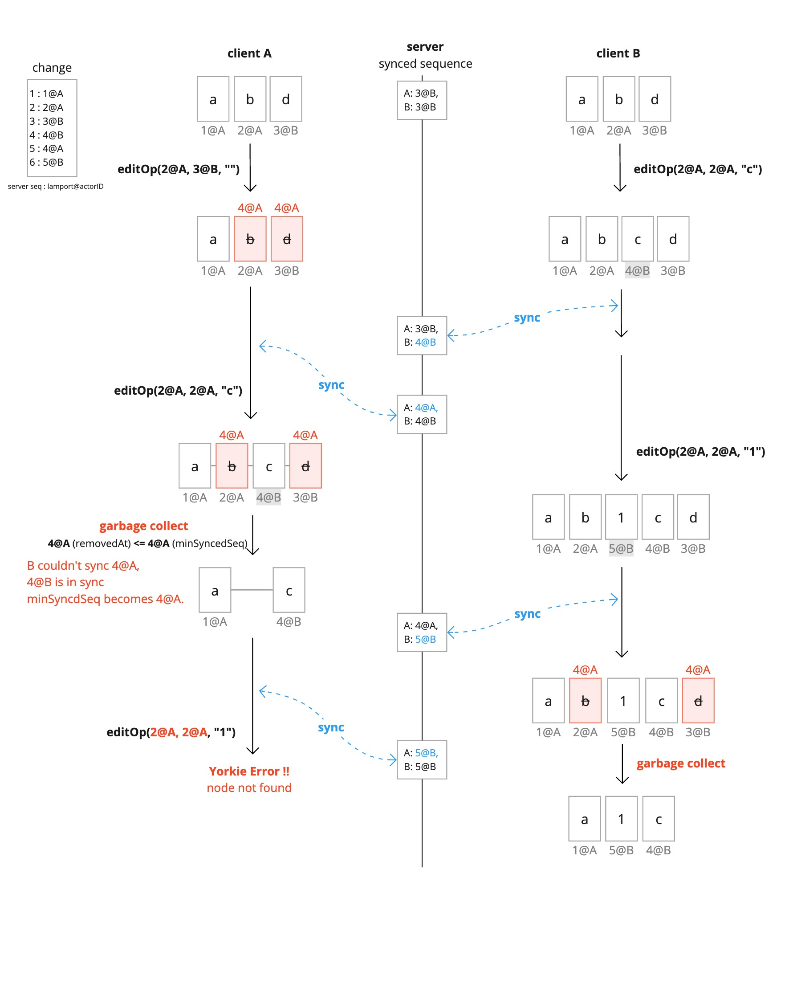
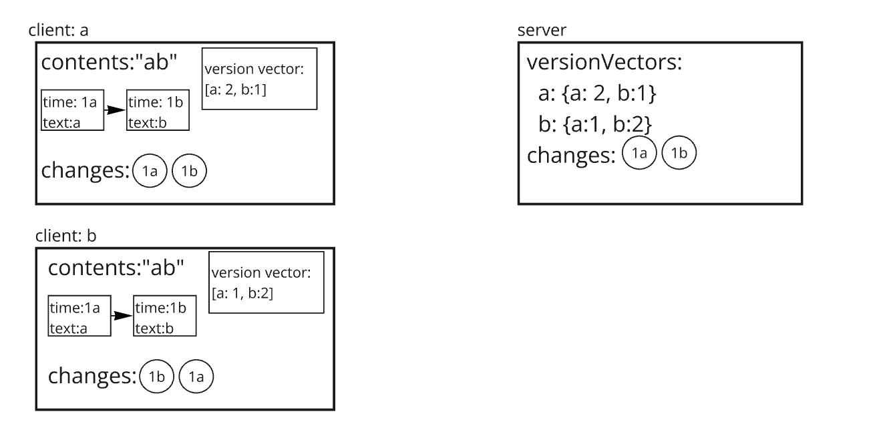
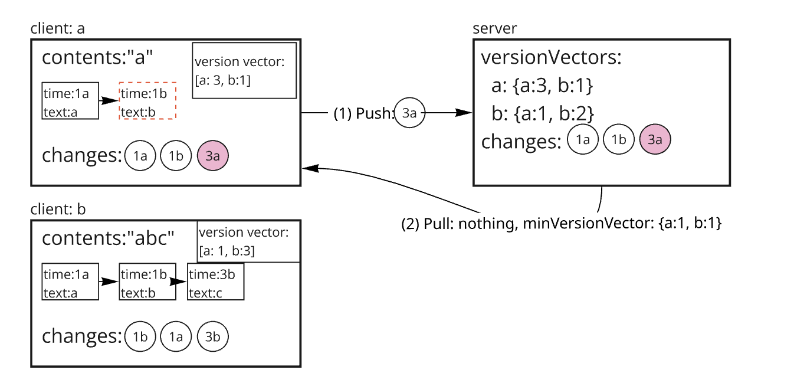
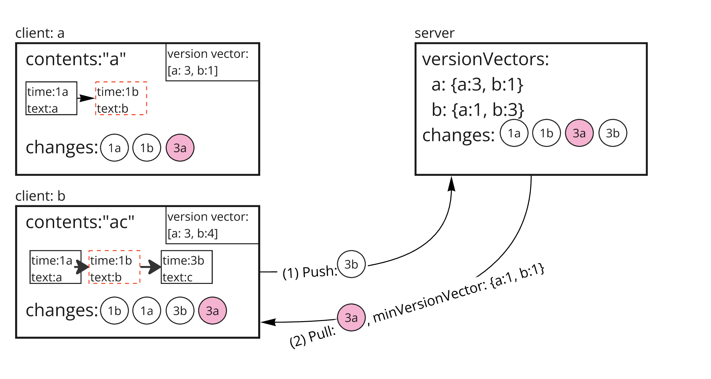
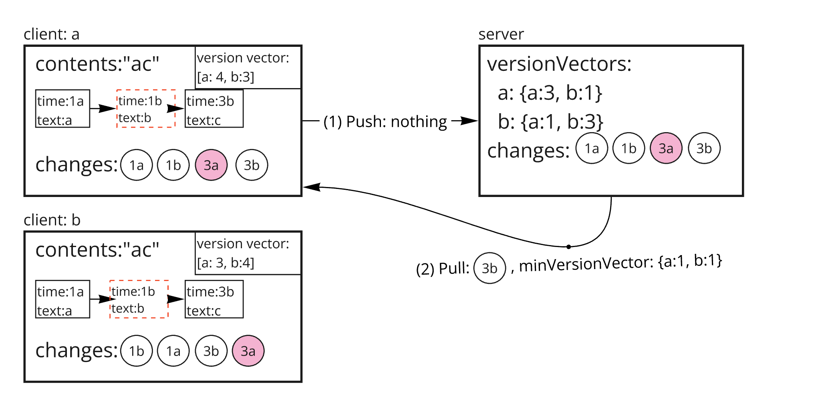
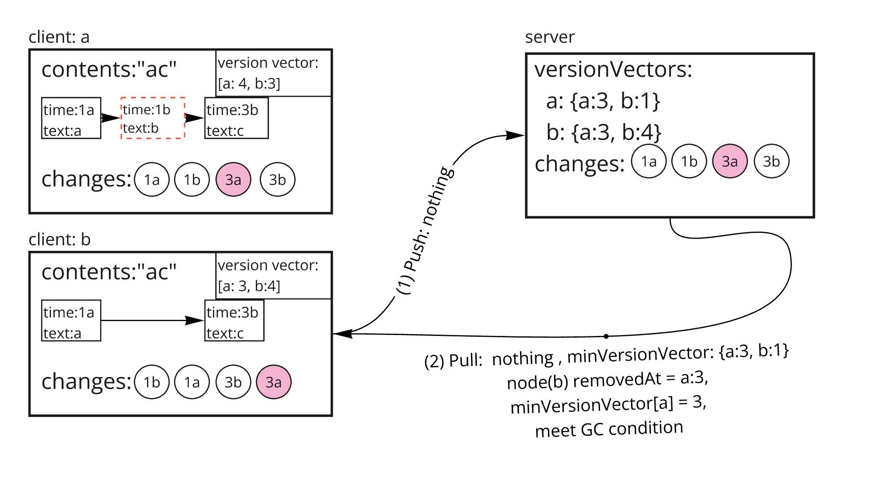
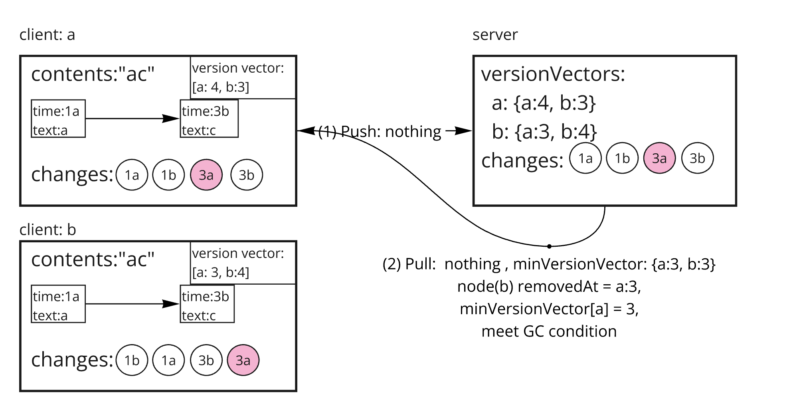

# Garbage Collection

## Before watch this document

In this document, the term referred to as `version vector` will be used throughout for explanatory purpose.
You'd better read [this](https://github.com/yorkie-team/yorkie/pull/981) first to understand concepts and usage of version vector.

## Summary

One of the most important issues in CRDT systems is handling tombstones. Tombstones are used to properly synchronize the document even when remote peer's operations refer to the elements that have already been locally deleted. This causes the problem that the document keeps growing even if elements are deleted.

Yorkie provides garbage collection to solve this problem.

### Goals

Implements garbage collection system that purges unused nodes not being referenced remotely.

### Non-Goals

For text types, garbage collection works slightly differently: refer to [this document](gc-for-text-type.md).

## Proposal Details

### Why We Need Version Vector rather than only use Lamport

Previously we used Lamport (`min_synced_seq`) to handle `Garbage Collection`. It was simple and lightweight to use, but it has crucial weakness that Lamport doesn't guarantee causality.


As you can see from the image above, `min_synced_seq` doesn't guarantee every client receives change.

### How It Works

Garbage collection checks that deleted nodes are no longer referenced remotely and purges them completely.

Server records the version vector of the last change pulled by the client whenever the client requests PushPull. And Server returns the min version vector, `minVersionVector` of all clients in response PushPull to the client. `minVersionVector` is used to check whether deleted nodes are no longer to be referenced remotely or not. A client may collect with it only after applying every change the server held when the vector was taken, which is why a push-only reply is not collected with (see below).

## What is `minVersionVector`

Min version vector is the vector which consists of minimum value of every version vector stored in version vector table in database.

Conceptually, min version vector is version vector that is uniformly applied to all users. It ensures that all users have at least this version applied. Which means that it is safe to perform GC, for a replica that has itself pulled every change up to the server's head.

```
// GC algorithm

if (removedAt.lamport <= minVersionVector[removedAt.actor]) {
    runGC()
}
```

```
// how to find min version vector

min(vv1, vv2) =>
for (key in vv1 || key in vv2) {
    minVV[key] = min(vv1[key] || 0, vv2[key] || 0)
}

ex)
min([c1:2, c2:3, c3:4], [c1:3, c2:1, c3:5, c4:3])
=> [c1:2, c2:1, c3:4, c4:0]

```

## Barriers beyond `removedAt`

`removedAt` coverage says the *value* is gone everywhere. It does not say the
*place* is settled: every container resolves a concurrent insert by walking the
nodes that are still linked, tombstones included, so unlinking one can change
where a still-in-flight operation lands. Two optional barriers (`crdt/gc.go`)
hold a purge back until that is settled as well, and both are Go-side policy
only — they narrow *when* a replica collects, never what any operation
computes, so a replica without them still agrees on every position. A replica
that collects earlier is the one exposed.

- `GCBarrier.PurgeBarrierAt` names one extra ticket: the node that would become
  the walk's new stopping point. `Tree`, `RGATreeList` and `RGATreeSplit`-backed
  containers all have one.
- `GCVectorBarrier.PurgeHeldBack` answers against the whole vector, for cases a
  single ticket cannot name. `Tree` uses it for §7.8 of
  `concurrent-merge-split.md`: a tombstone stays linked while an ancestor that
  rule could still reach as an unknown split sibling — a live element inside an
  `InsNextID` chain, created outside the collecting vector — is still
  outstanding. Note the shape of the collecting vector when reasoning about it:
  `MinVersionVector` carries `0` for an actor some attached client's vector
  lacks, and carries no entry at all for an actor that has detached. An actor
  the vector does not name is treated as settled, because a detaching client
  pushes before its entry is dropped.

`yorkie-js-sdk` does not implement `PurgeHeldBack` yet.

## GC Responsibility by Response Type

GC responsibility is split between server and client depending on the response type:

- **Snapshot response**: The server runs GC with `minVersionVector` before serializing the snapshot. The client receives a clean state and skips GC (`!pack.hasSnapshot()` guard in the SDK).
- **Changes response**: The server sends `minVersionVector` in the response pack. The client runs GC locally using this vector after applying the changes.
- **Push-only response**: The server still sends `minVersionVector` (except to a disable-GC attachment, which gets none), but the client takes the reply as a push ack only (confirmed local changes, client seq, removal flag) and skips GC. The vector can already cover a removal whose concurrent remote changes this client has not pulled; collecting the tombstone they anchor on would leave the next full pull unable to apply them (`node not found`). The next full pull applies those changes first and then collects with that pull reply's `minVersionVector`.

This means the server must always GC the document before building a snapshot response. Without this, tombstones from applied changes would leak into the snapshot and persist on the client, since the client does not run GC for snapshot responses by design.

## An example of garbage collection:

### State 1



In the initial state, both clients have `"ab"`.

### State 2



`Client a` deletes `"b"`, which is recorded as a change with versionVector `{b:1}`. The text node of `"b"` can be referenced by remote, so it is only marked as tombstone. And the `Client a` sends change `3a` to server through PushPull API and receives as a response that `minVersionVector` is `{a:1, b:1}`. Since all clients did not receive the deletion `change 3a`, the text node is not purged by garbage collection.

Meanwhile, `client b` inserts `"c"` after textnode `"b"` and it has not been sent (pushpull) to server yet.

### State 3



`Client b` pushes change `3b` to server and receives as a response that `minVersionVector` is `{a:1, b:1}`. After the client applies change `3a`, the contents of document are changed to `ac`. This time, all clients have received change `3a`. Since node "b" is removed at `3a`, it's still marked as tombstone for every clients, because `minVersionVector[a] = 1 < 3`

### State 4



`Client a` pulls change `3b` from Server. `minVersionVector` is still `{a:1, b:1}`, so no GC happens.

### State 5



`Client b` pushpull but nothing to push or pull. `minVersionVector` is now `{a:3, b:1}`, node "b" removedAt is `3@a`, and `minVersionVector[a] = 3 >= 3`, thus `client b` meets GC condition

### State 6



`Client a` pushpull but nothing to push or pull. `minVersionVector` is now `{a:3, b:3}`, node "b" removedAt is `3@a`, and `minVersionVector[a] = 3 >= 3`, thus `client a` meets GC condition
