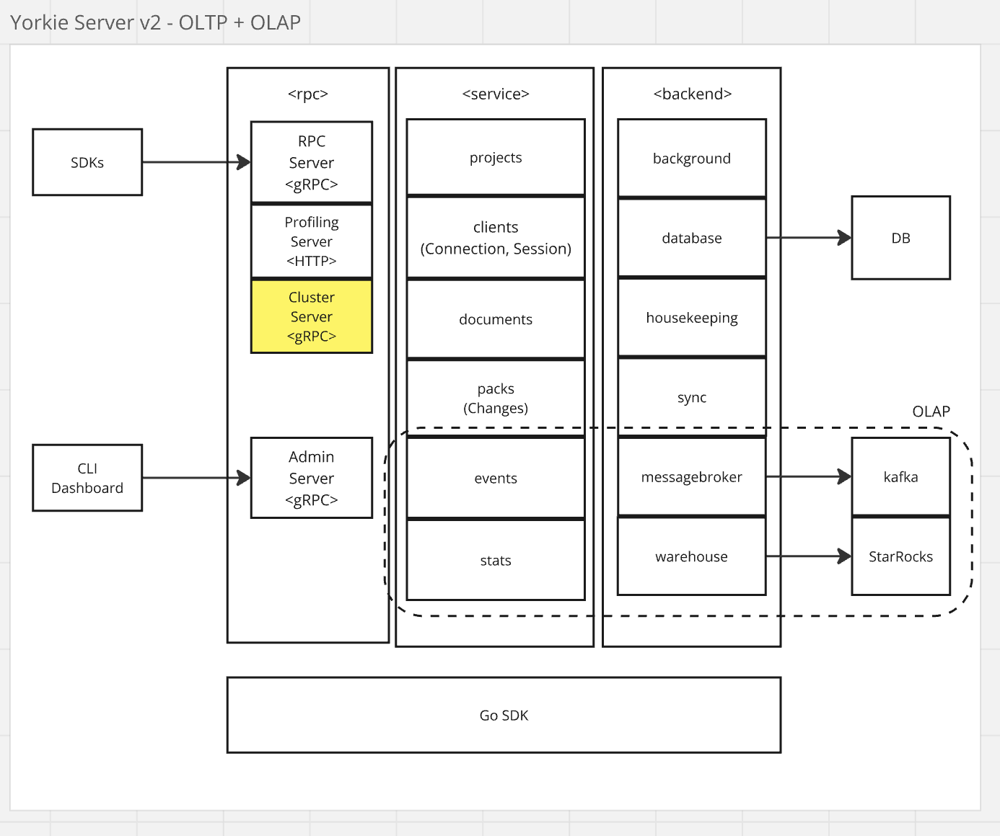

# OLAP Stack for MAU Tracking

## Summary

To accurately measure Monthly Active Users (MAU) for the Yorkie Project, we propose introducing an OLAP stack. This stack will leverage Kafka for event streaming and StarRocks for efficient OLAP query processing. The implementation will enable real-time data aggregation and analytics, providing valuable insights into user activity trends.

> MAU was the first consumer, not the last. The stack now carries five event families — user, document, client, channel and session — each with its own Kafka topic and StarRocks table, and they feed the six warehouse-backed metrics the dashboard renders through `GetProjectStats`. The sections below describe the original design; where a detail has since changed, it says so.

## Goals

- Implement a scalable OLAP stack to measure MAU effectively.
- Enable real-time data ingestion and aggregation.
- Ensure efficient querying and analytics using StarRocks.

## Non-Goals

- This proposal does not cover security by storing hashed UserIDs instead of raw identifiers.

## Proposal Details

To integrate OLAP capabilities into Yorkie, we introduce the following components:

### **Architecture Overview**

[](./media/olap-stack.png)

- **Events Package**: Handles event generation and processing from Yorkie clients.
- **Stats Package**: Computes statistical metrics and aggregations.
- **Message Broker**: Uses Kafka to manage real-time event streaming.
- **Warehouse Module**: Stores and processes data in StarRocks for OLAP queries.

### **Client Integration**

Clients will include metadata for user identification:

```javascript
const client = new yorkie.Client("https://api.yorkie.dev", {
  apiKey: "xxxxxxxxxxxxxxxxxxxx", // Identify the project
  metadata: { userID: "user-1234" }, // Identify the user
});
```

#### **Data Flow**

1. Yorkie clients generate events(e.g., client activation, document edits).
2. Events are streamed via Kafka, one topic per event family.
3. StarRocks ingests each topic into its own table with a Routine Load job.
4. The dashboard queries those tables through `GetProjectStats`.

Step 4 reads the raw event tables, so its cost grows with event volume. Since 0.7.17 each table also carries a synchronous materialized view holding one HLL sketch per `(project, day)`, and StarRocks rewrites the dashboard's queries onto it — see [Project Stats Warehouse Materialized Views](project-stats-warehouse-mv.md).

### Risks and Mitigation

- **High Data Volume**: Implement partitioning and indexing strategies in StarRocks. In practice the answer was pre-aggregation rather than partitioning: the event tables are still unpartitioned, and the read cost was removed with daily HLL rollups instead ([Project Stats Warehouse Materialized Views](project-stats-warehouse-mv.md)).
- **Security Concerns**: Store only hashed UserIDs to protect user privacy. Not implemented — consistent with the non-goal above, `user_events.user_id` holds the identifier the client supplies in its metadata, unhashed.
- **Scalability**: Use Kafka’s distributed architecture to handle high throughput.

By implementing this OLAP stack, Yorkie will gain a powerful analytics framework to track MAU efficiently and support data-driven decision-making for user activity trends.
