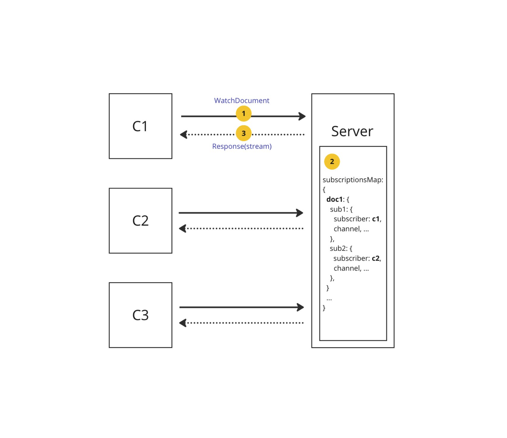
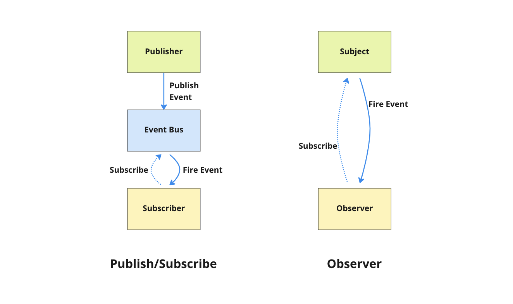

# PubSub

## Summary

Yorkie needs to share events happening in documents with different clients. For
this, we implemented this feature using gRPC server-side stream and the PubSub
pattern.

### Goals

We should be able to share events with other clients who are subscribing to
Documents.

## Proposal Details

### WatchDocument API

In Yorkie, we use gRPC-Web and it currently supports 2 RPC modes: unary RPCs, server-side streaming RPCs. ([Client-side and Bi-directional streaming is not supported.](https://github.com/grpc/grpc-web#streaming-support)). Server-side streaming allows the server to send multiple messages in response to a single client request.


Yorkie implements WatchDocument API using [gRPC server-side streaming](https://grpc.io/docs/languages/go/basics/#server-side-streaming-rpc) to deliver the events to other clients.

```protobuf
// api/yorkie.proto

service Yorkie {
    ...
  rpc WatchDocument (WatchDocumentRequest) returns (stream WatchDocumentResponse) {}
}
```

In brief, when the client sends a WatchDocument request, it establishes a stream connection(1). On the server side, when changes occur in a document, it retrieves the clients watching that document in the subscriptionsMap(2), and then sends responses through the server stream to those clients(3). As a result, clients watching the document can receive response about its changes through the stream without the separate requests.



### How does it work?

We are using the [PubSub pattern](https://en.wikipedia.org/wiki/Publish%E2%80%93subscribe_pattern) for handling event delivery targets. For more details, you can check out the [sync package](https://github.com/yorkie-team/yorkie/blob/main/server/backend/sync/pubsub.go) that we're working on.



The process of the event pub-sub is as follows:


#### 1. Set SubscriptionsMap

The `WatchDocument` API creates a `Subscription` instance and adds it to the `subscriptionsMap`[(code🔍)](https://github.com/yorkie-team/yorkie/blob/5911fc160186f8dac59bd2c57146632342fcf4a3/server/rpc/yorkie_server.go#L567-L573). The `Subscription` instance internally manages the `DocEvent channel`.

```go
// Subscription represents a subscription of a subscriber to documents.
type Subscription struct {
        id         string
        subscriber time.ActorID
        mu         sync.Mutex
        closed     bool
        events     chan events.DocEvent
}
```

#### 2. Publish Event

When changes occur in a document through WatchDocument or PushPull, the `Publish` method is called to send out a `DocEvent` which includes events such as `DocWatched`, `DocUnwatched`, and `DocChanged`.

```go
// server/rpc/yorkie_server.go
func (s *yorkieServer) watchDoc(...) (...) {
	// ...
	// Publish DocWatched during watchDocument 
	s.backend.PubSub.Publish(ctx, sub.Subscriber(), events.DocEvent{
		Type:      events.DocWatched, 
		Publisher: sub.Subscriber(), 
		DocRefKey: docKey,
	})

	// ...
}

// server/packs/pushpull.go
func PushPull(...) (...) {
	// ...
	// Publish DocChanged during pushpull
	be.PubSub.Publish(ctx, publisher, events.DocEvent{
		Type:      events.DocChanged,
		Publisher: publisher,
		DocRefKey: docKey,
	})

	// ...
}
```

#### 3. Fire Event

The `Publish` method sends a `DocEvent` to the event channel of subscriptions that are subscribing to the document of the `DocEvent`. Through `subscriptionsMap`, we can find the subscriptions (created in step 1) that are subscribing to a specific document. Subsequently, the `DocEvent` is sent to the event channels of these subscriptions. [(code🔍)](https://github.com/yorkie-team/yorkie/blob/be6520ee8bdb8d91a50ff421b259bbb29a6332a9/server/backend/pubsub/pubsub.go#L203-L231).

```go
// server/backend/pubsub/pubsub.go
// Publish publishes the given event.
func (m *PubSub) Publish(
	ctx context.Context,
	publisherID time.ActorID,
	event events.DocEvent,
) {
	// ...
	
	docKey := event.DocRefKey
	
	// ...
	
	if subs, ok := m.subscriptionsMap.Get(docKey); ok {
		subs.Publish(event)
	}
	
	// ...
}

// server/backend/pubsub/publisher.go
func (bp *BatchPublisher) Publish(event events.DocEvent) {
        bp.mutex.Lock()
        defer bp.mutex.Unlock()
		
        if event.Type == events.DocChanged {
            count, exists := bp.docChangedCountMap[event.Publisher.String()]
            if exists && count > 1 {
                return
            }
            bp.docChangedCountMap[event.Publisher.String()] = count + 1
        }

        bp.events = append(bp.events, event)
}

```

#### 4. Send watchDocument response to stream

When the event channel of `Subscription` receives an event, the event is sent to the `WatchDocumentResponse` of the rpc stream. [(code🔍)](https://github.com/yorkie-team/yorkie/blob/5911fc160186f8dac59bd2c57146632342fcf4a3/server/rpc/yorkie_server.go#L530-L556)

```go
func (s *yorkieServer) WatchDocument(
        ctx context.Context,
        req *connect.Request[api.WatchDocumentRequest],
        stream *connect.ServerStream[api.WatchDocumentResponse],
) error {
        // ...

        for {
            select {
            case <-s.serviceCtx.Done():
                return context.Canceled
            case <-ctx.Done():
                return context.Canceled
            case event := <-subscription.Events():
                eventType, err := converter.ToDocEventType(event.Type)
                if err != nil {
                    return err
                }

                response := &api.WatchDocumentResponse{
                    Body: &api.WatchDocumentResponse_Event{
                        Event: &api.DocEvent{
                            Type:      eventType,
                            Publisher: event.Publisher.String(),
                            Body: &api.DocEventBody{
                                Topic:   event.Body.Topic,
                                Payload: event.Body.Payload,
                            },
                        },
                    },
                }
                if err := stream.Send(response); err != nil {
                    return err
                }
            }
        }

        // ...
}
```

### Risks and Mitigation

Currently, Subscription instances are managed in memory.
