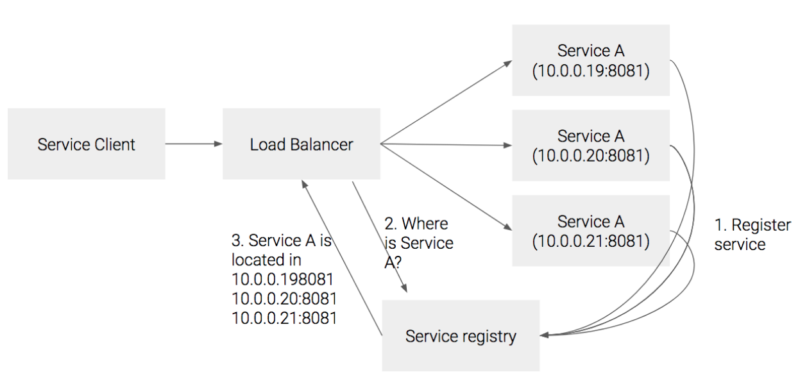

# Sharded Cluster Mode

## Summary

In a production environment, a server cluster is necessary to handle large workloads while ensuring high availability, reliability, and scalability.

Yorkie provides a sharded cluster mode to support production environments.

Sharded (lookup-based) cluster mode’s main idea is to assign each server to process the same workloads to avoid multiple servers accessing the same data and to use a lookup system to route the same workloads to the same servers.

Sharded cluster mode can reduce or remove additional overheads needed for workload synchronization in previous broadcast cluster mode, which used distributed locking between servers. And become capable of handling large amounts of workload while ensuring high availability, reliability, and scalability.

### Goals

Provide sharded cluster mode on the server to support the production environment.

### Non-Goals

This document will only explain the core concepts and implementation of sharded cluster mode. Additional configuration in the K8s/Istio environment will not be covered in this document.

## Proposal Details

### How does it work?

There are three aspects to be considered when designing a sharded cluster mode.

**Workload Unit**

Sharded cluster mode uses `document` as a workload unit to assign each server to process the same workloads. This assigns and separates `document`’s state and data to each server, which removes the need to share and sync states and data between server clusters.

**Sharding Strategy**

Sharded cluster mode uses [Consistent Hashing](https://en.wikipedia.org/wiki/Consistent_hashing) for sharding strategy.

Consistent hashing is a technique used to map a range of input values (such as the request header) to a corresponding range of output values (such as server IDs).

The basic idea of consistent hashing is to assign each server to a point on a circular ring or continuum of hash values. When a request arrives, its hash value is computed, and the server responsible for that hash value is determined by finding the next server on the ring, starting from the point where the hash value falls.

This ensures nearby hash values are assigned to the same server, providing a degree of consistency in server assignments.


As you can see above, the computed hash value is mapped to the closest server in a clockwise direction; therefore, `k0(codepair$xqvlad)` is mapped to `s0(server 0)`.

Also, even when `s0` fails, `k0` can be mapped to `s4(server 4)`, and other mapping does not change. This mechanism is called _**minimal disruption**_, and consistent hashing ensures that only `key/number_of_backends` are remapped when upstream host set changes.

What we explained above is called `Ring hash` algorithm. Using ring hash-based load balancing ensures session affinity between requests from a specific workload (`document`) and an upstream host (`yorkie server`).

Also, there is another consistent hashing-based algorithm called `Maglev`. Maglev is used in Google’s load balancer, and it is more efficient than the traditional consistent hashing algorithm.

Maglev ensures minimal disruption, like Ring hash. But unlike Ring hash, Maglev also ensures _**efficient load balancing**_ by using preference list permutation and lookup table population.

This is because Ring Hash always recalculates the whole hash table whenever there are changes in upstream hosts, but Maglev only recaulcates the preference list for changed hosts and repopulates the hash table only with the changes made in the preference list to the lookup table. This makes Maglev more efficient than Ring hash on rehashing calculations.

Sharded cluster mode in Yorkie supports both the Ring hash and Maglev algorithms for hash-based sharding.

For more information about Maglev, follow: [Maglev: A Fast and Reliable Software Network Load Balancer](https://ai.google/research/pubs/pub44824)

**LookUp Strategy**

Sharded cluster mode uses server-side discovery for the lookup strategy.



In server-side discovery, there is a proxy server (load balancer) in front of services. After services register themselves in the service registry, proxy servers can get service locations from the service registry. Now, when clients connect to a proxy server, the proxy server routes them to the proper service based on the service registry’s information.

**System Design & Architecture**

Considering all the factors mentioned above, we can design an architecture for sharded cluster mode.


There are only three components needed for implementing a sharded cluster.

- `Yorkies`: Yorkies is the router (proxy) responsible for routing based on request. Yorkies receives requests from clients and routes them to servers based on the computed request’s hash key and consistent hashing algorithm.
- `Yorkie Service Registry`: Service registry is responsible for storing metadata and configuration settings for Yorkie servers.
- `Yorkie Service(s)`: Services to process specific workloads. Here, a single Yorkie server is used to process certain workloads.

These components are very similar to mongoDB's sharding component, in which `Yorkies` corresponds to `mongos (router)`, `Yorkie Service Registry` with `config server (registry)`, and `Yorkie Service(s)` with `mongod (shard)`.

**Sharded Cluster Mode Implementation (K8s & Istio)**

Sharded cluster mode can be easily implemented by using [Kubernetes](https://kubernetes.io/) and [Istio](https://istio.io/). Kubernetes is a container orchestration system, and Istio is a service mesh for Kubernetes, which internally uses [envoy](https://github.com/envoyproxy/envoy) L7 proxy for traffic control.

Below is the implementation architecture of a sharded cluster using K8s and Istio.


By using K8s and Istio, `Yorkies` can be implemented with `Istio Ingress Gateway (envoy)`, and `Yorkie service registry` can be implemented with `Istio Pilot (istiod)`.

When Yorkie server pods are deployed, Kubernetes registers them to `service registry (etcd)` and `Istio Pilot` can get service locations from the service registry. After that, `Istio Ingress Gateway (envoy)` can route to the proper service based on the service registry’s information retrieved from `Istio Pilot`.

By using Istio's `Gateway`, `VirtualService`, and `DestinationRule` resources, we can configure `Istio Ingress Gateway (envoy)` to route requests to proper service. Especially `consistentHash` option in `DestinationRule` can be used to route requests based on the computed request’s hash key and consistent hashing algorithm.

Here is an example of `DestinationRule` resource.

```yaml
apiVersion: networking.istio.io/v1alpha3
kind: DestinationRule
metadata:
  name: yorkie
spec:
  host: yorkie
  trafficPolicy:
    portLevelSettings:
      - port:
          number: 8080
        loadBalancer:
          consistentHash:
            ringHash:
              minimumRingSize: 1024
            httpHeaderName: "x-shard-key"
```

In this configuration, `consistentHash` is configured to use `ringHash` algorithm with `minimumRingSize` of `1024`. This will be used to route requests based on the computed request’s hash key and ring hash algorithm, with a size of `1024` virtual nodes.

```yaml
---
loadBalancer:
  consistentHash:
    maglev:
      tableSize: 65537
    httpHeaderName: "x-shard-key"
```

We can also use `Maglev` algorithm by using `maglev` instead of `ringHash`. This will be used to route requests based on the computed request’s hash key and Maglev algorithm with a size of `65537` lookup table.

For the hash function parameter in load balancing, `httpHeaderName` is used. This routes the workload based on the HTTP header’s value. For example, using `x-shard-key` separates workloads in `project/document` unit.

### Risks and Mitigation

There are some risks and issues to be considered in sharded cluster mode.

**WatchDocument's Split Brain Issue on Hash-based LB**

`WatchDocument` uses gRPC's server-side streaming based on the long-lived connection of HTTP 2.0.

When a server is added or removed from the cluster, all requests will be rerouted to the new server. However, a long-lived connection like `WatchDocument` will keep connected to the old server and not be rerouted to the new server. We call this issue a _**split brain**_ issue of long-lived connection.

Below is an explanation of how the split-brain of long-lived connections occurs.


For now, we can mitigate this issue with the following solutions:

- gRPC `Max Connection Age` & `Max Connection Age Grace`: gRPC provides `MaxConnectionAge` and `MaxConnectionAgeGrace` options to close long-lived connections. We can use this option to explicitly close long-lived connections periodically and ensure that connections are rerouted to a new server after some period of time.
- envoy `Stream Idle Timeout`: envoy provides `stream_idle_timeout` option to close a long-lived connection. Since connections will be idle when split-brained, we can use this option to explicitly close long-lived connections when they are idle and ensure that they are rerouted to a new server.

The solutions mentioned above are a forceful way to close a long-lived connection, so they are not a perfect solution. In further updates, we will introduce a graceful way to close a long-lived connection using `GOAWAY` frame of HTTP 2.0.

**Housekeeping in Sharded Cluster Mode**

When we use a server cluster, we are performing housekeeping on every server in the cluster. But this is not an efficient way to perform housekeeping because all the servers are performing redundant housekeeping on the same data that is already housekeeped on other servers.

There are two options available to solve this issue:

1. Only the master server executes housekeeping in the cluster.
2. Split housekeeping tasks per project and execute them on servers mapped by project.

For now, we are using option 1 (only the master server executes housekeeping in the cluster), with leader election for electing the master server for simplicity. However, we will use option 2 in future updates.
